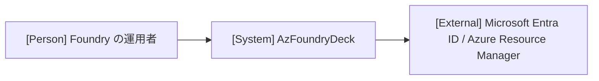

# アーキテクチャ

全体構造、共通方針、設計上の制約の正本です。具体的な処理は実現パターンの設計、保存形式は [データ設計](design/data.md)、仕様は [ユースケース一覧](project.md#usecases) から参照します。

## 1. システムコンテキスト

外部の人物・システムと本システムの関係を1枚で示します（Person には主アクター名を指定）。

## 2. コンテナ

| コンテナ | 技術 | 責務 | リポジトリ内パス |
| --- | --- | --- | --- |
| デスクトップアプリ | Wails v3 / Go / React | 画面表示、Azure SDK の呼び出し、ログイン状態の保持と保存 | `main.go`、`internal/`、`frontend/` |

単一コンテナ構成です。外部の Entra ID と Azure Resource Manager へは Azure SDK 経由でのみ接続します。モックの切り替え境界（合成点）はありません。E2E 用ビルド（`e2e` タグ）に限り、Entra ID・Azure Resource Manager と資格情報マネージャーの境界を固定応答とテスト用の保存先に差し替えます（[実行手順](project.md#commands)）。

全体の依存方向、状態の所有者と永続化の共通方針を記し、関係線ごとにモック切り替え境界（合成点）の有無を記載します。単一コンテナ構成の場合は図を省略し、1文の記述で代替可能です。

## 3. 実現パターン

| 実現パターンの設計 | 適用条件・関与コンテナ |
| --- | --- |
| [UCP-1](design/UCP-1.md) | 画面操作から Go サービスが Azure SDK を呼ぶ全ユースケース（デスクトップアプリ単一コンテナ） |

## 4. 設計上の制約

- Azure SDK の呼び出しは Go 側のサービスに限り、フロントエンドは Azure へ直接接続しない。
- ログイン状態はメモリで保持し、永続化するのは OS のクレデンシャルマネージャー上のアカウント識別情報と、Azure SDK の永続キャッシュ上のトークンのみとする。アカウント識別情報は `go-keyring` で汎用資格情報 `AzFoundryDeck:AuthenticationRecord` に、トークンは `azidentity/cache` の永続キャッシュ（名前 `azfoundrydeck`、Windows では DPAPI 暗号化ファイル）に保存する。保存手段の根拠は [確認した事実](project.md#design) を参照する。

現在の設計が満たすべき制約と適用範囲を記述します。第1〜3節で表せる構成や責務は各節へ集約します。外部仕様に依存する場合は [確認した事実](project.md#design) を参照します。
