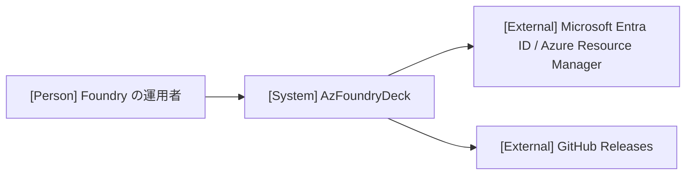

# アーキテクチャ

全体構造、共通方針、設計上の制約の正本です。具体的な処理は実現パターンの設計、保存形式は [データ設計](design/data.md)、仕様は [ユースケース一覧](project.md#usecases) から参照します。

## 1. システムコンテキスト

外部の人物・システムと本システムの関係を1枚で示します（Person には主アクター名を指定）。

## 2. コンテナ

| コンテナ | 技術 | 責務 | リポジトリ内パス |
| --- | --- | --- | --- |
| デスクトップアプリ | Wails v3 / Go / React | 画面表示、Azure SDK の呼び出し、ログイン状態の保持と保存、Foundry とデプロイ済みモデルの取得・保持、Foundry 一覧と選択のファイル保存、新版の確認・取得・検証 | `main.go`、`internal/`、`frontend/` |

単一コンテナ構成です。外部の Entra ID と Azure Resource Manager へは Azure SDK 経由でのみ接続します。Go サービスがログイン状態と取得結果の確定を担当し、Home画面は返された Foundry とモデルをメモリに保持します。E2E 用ビルド（`e2e` タグ）に限り、Entra ID・Azure Resource Manager と資格情報マネージャーの境界を固定応答とテスト用の保存先に差し替えます。新版の確認は、指定したときだけ GitHub Releases の代わりにローカルの署名付きの新版を更新元にします（[合成点](design/UCP-3.md#状態の確定と失敗時の扱い)）。閲覧は外部取得の `foundry.Source` を差し替え、選択・保存・表示を本番と同じ処理で行います（[合成点](design/UCP-1.md#デプロイモデルを閲覧する)、[実行手順](project.md#commands)）。

Home画面の取得進捗モーダルは、Go サービスが通知する Wails の型付きイベントを受け取り、生成された共通型で状態を表示します。進捗と取得結果の状態は Go サービスが管理し、画面に固定タイムラインを置きません。具体的な型、購読、取得キューと固定応答の境界は [UCP-1](design/UCP-1.md#デプロイモデルを閲覧する) を、変更先のデプロイ取得の扱いは [Foundry の変更](design/UCP-1.md#foundryを変更し閲覧する) を参照します。

選択対象の Foundry が確定したら、デプロイ一覧と容量上限の元になる情報を並行して取得します。一覧は容量上限の完了を待たずに表示します。容量上限の取得状態と結果は Go サービスがメモリに保持し、画面は保持状態と完了通知から明細を更新します。保持範囲、破棄と失敗時の扱いは [明細の設計](design/UCP-1.md#一覧からデプロイモデルの明細を表示する) に従います。

全体の依存方向、状態の所有者と永続化の共通方針を記し、関係線ごとにモック切り替え境界（合成点）の有無を記載します。単一コンテナ構成の場合は図を省略し、1文の記述で代替可能です。

## 3. 実現パターン

| 実現パターンの設計 | 適用条件・関与コンテナ |
| --- | --- |
| [UCP-1](design/UCP-1.md) | 画面操作から Go サービスが Azure SDK を呼ぶ全ユースケース（デスクトップアプリ単一コンテナ） |
| [UCP-2](design/UCP-2.md) | インストーラーをReleasesへ発行する、アプリをインストールする。Git・Windows CI・GitHub Releasesによる配布処理とNSISによるインストール処理 |
| [UCP-3](design/UCP-3.md) | 新版を確認してアプリを更新する。検証済みの新版をインストーラーへ引き渡し、アプリの終了後に確定する。デスクトップアプリ、更新インストーラー、外部の GitHub Releases |

## 4. 設計上の制約

- Azure SDK の呼び出しは Go 側のサービスに限り、フロントエンドは Azure へ直接接続しない。
- ログイン状態はメモリで保持する。アカウント識別情報は `go-keyring` で OS のクレデンシャルマネージャーの汎用資格情報 `AzFoundryDeck:AuthenticationRecord` に、トークンは `azidentity/cache` の永続キャッシュ（名前 `azfoundrydeck`、Windows では DPAPI 暗号化ファイル）に保存する。保存手段の根拠は [確認した事実](project.md#design) を参照する。
- 失敗は、エラーコードと理由を利用者に表示する。表示形式と表示場所は [エラーの表示](design/UCP-1.md#エラーの表示) に従う。
- デプロイモデルの閲覧で取得した Foundry の一覧と選択済みの Foundry だけをファイルに保存する。選択された Foundry の全デプロイ済みモデルは保存せず、アプリ起動・Foundry の変更・テナントの変更・更新・追加/変更/削除の成功後に Azure から取得してメモリに保持する。保存形式と保存先は [データ設計](design/data.md#foundry-とデプロイモデル) を参照する。

現在の設計が満たすべき制約と適用範囲を記述します。第1〜3節で表せる構成や責務は各節へ集約します。外部仕様に依存する場合は [確認した事実](project.md#design) を参照します。
