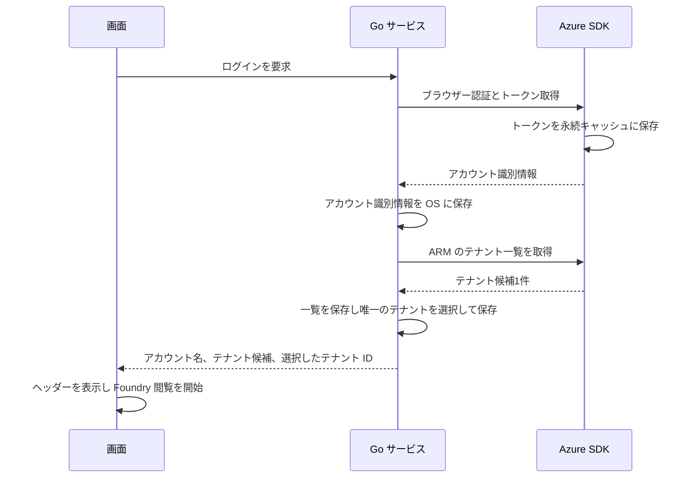
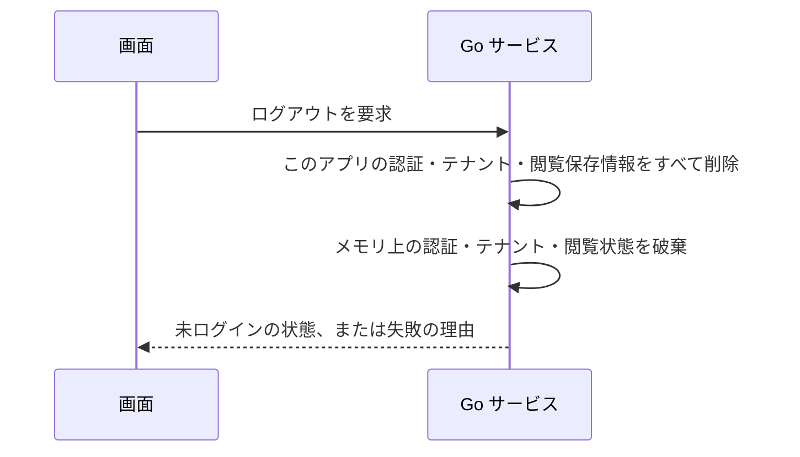
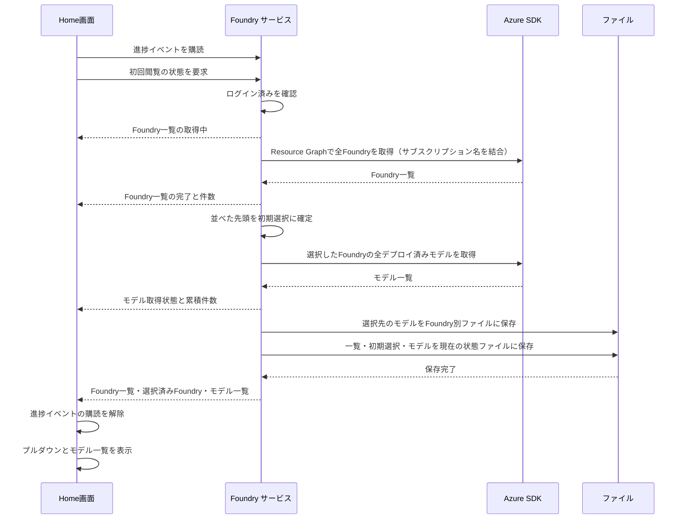
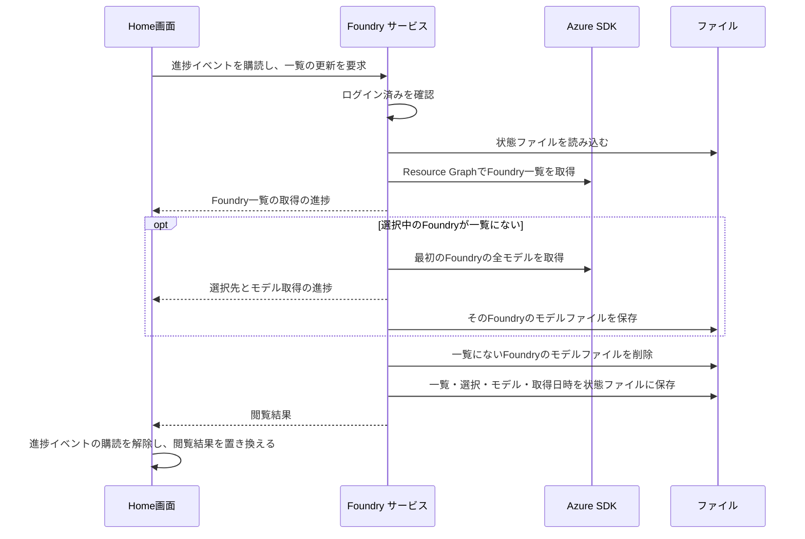

# UCP-1. 画面操作から Go サービス経由で Azure SDK を呼ぶ

適用条件と関与コンテナは [アーキテクチャの一覧](../architecture.md#patterns) を参照します。パターンからの逸脱は対象 UC ごとに本書へ記録します。図は主成功系列を役割名で示します。

| 役割 | 責務 | 実装パス |
| --- | --- | --- |
| 画面 | ボタンと状態（未ログイン・サインイン待ち・ログイン済み・失敗）の表示、ユーザーアイコンのメニューからのログアウト、ヘッダーのテナントプルダウンからのテナント変更の呼び出しと失敗バナーの表示 | `frontend/src/usecases/azure-login/AzureLogin.tsx`、`frontend/src/routes/index.tsx`、`frontend/src/shared/ErrorNotice.tsx`、`frontend/src/usecases/azure-logout/AccountMenu.tsx`、`frontend/src/features/auth/queries.ts` |
| Go サービス | ログインの実行、保存済み認証記録・テナント一覧・選択からの起動時復元、ログイン済みでのテナント変更（変更先のトークン取得と選択保存）、ログアウト、ログイン状態の保持、認証記録・テナント一覧・選択の同一 JSON での保存・読み出し・削除、永続キャッシュのファイル削除 | `internal/azauth/service.go`、`internal/azauth/login_record.go`、`internal/azauth/credential_manager.go`、`internal/azauth/token_cache_windows.go`、`record_store.go` |
| 起動時の接続 | アカウントと選択テナントに応じた閲覧保存先の決定、ログアウト時の全閲覧保存先と旧保存先の削除 | `main.go` |
| Azure SDK | `azidentity` によるブラウザー認証、トークン取得と永続キャッシュへの保存、永続キャッシュからのブラウザーを開かないトークン取得、ARM からのテナント一覧取得 | `internal/azauth/browser.go` |
| Home画面 | ログイン済みでの閲覧要求、Foundry 一覧の取得・モデル取得の進捗モーダル、Foundry の選択変更と Foundry 一覧・デプロイモデルの更新、プルダウンとデプロイ済みモデル・最終取得日時の表示、取得結果のメモリ保持 | `frontend/src/routes/index.tsx`、`frontend/src/usecases/initial-deployments/InitialDeployments.tsx`、`frontend/src/usecases/initial-deployments/AcquisitionProgressModal.tsx`、`frontend/src/features/foundry/initial-view.ts`、`frontend/src/features/foundry/change-view.ts`、`frontend/src/features/foundry/refresh-view.ts`、`frontend/src/features/foundry/refresh-deployments.ts`、`frontend/src/features/foundry/progress.ts` |
| Foundry サービス | ログイン済みの確認、保存済みファイルの読み込み、Foundry の選択と変更、Foundry 一覧の更新と一覧にない Foundry のモデルファイル削除、選択中の Foundry のモデルの更新、一覧取得に続くモデル取得、進捗イベントの通知、全取得後のファイル保存、Foundry ごとのモデル保持、結果確定 | `main.go`、`foundry_source.go`、`internal/foundry/service.go`、`internal/foundry/models.go`、`internal/foundry/progress.go`、`internal/foundry/storage.go` |
| Foundry の Azure SDK 境界 | Azure Resource Graph による Foundry 一覧の取得（サブスクリプション名の結合を含む）、選択した Foundry の全デプロイ済みモデル取得 | `internal/foundry/azure.go` |

初回認証と保存済みログイン情報の復元では `EnableCAE: true` で ARM トークンを取得し、後続の ARM クライアントと同じ CAE 用キャッシュを使う。

## ブラウザーでAzureにサインインする

認証結果のアカウントと、Azure Resource Manager から取得した利用対象のテナント候補を区別する。認証記録のテナント ID は候補一覧と照合せず、対象テナントの決定にも使わない。ブラウザーでのサインイン時に一覧の ID・表示名を取得して保存し、通常起動時とテナント変更時には保存済みの一覧を使う。候補が1件の場合は Go サービスがそのテナントを自動選択し、一覧と選択を保存した後に画面へ返す。画面はヘッダーに選択されたテナントのプルダウンとユーザーアイコンを表示し、選択完了後に Foundry 閲覧を開始する。

入出力は `internal/azauth/service.go` の `Status`（`Phase`、`Account`）、`Account`（`Username`、`Tenants`、`SelectedTenantID`）、`Tenant`（`ID`、`DisplayName`）を Wails のバインディングで生成し、単一テナントと複数テナントの系列で共有する。テナント変更は未接続であり、別の系列で扱う。一覧と選択の保存形式、および閲覧データのアカウント・テナント別保存範囲は [データ設計](data.md) に従う。

画面確認用の E2E ビルドでは、`internal/azauth/e2e.go` の `signIn` が固定の認証記録を返し、`listTenants` が固定の一覧を返す。固定アカウントは `operator@contoso.onmicrosoft.com`、唯一の候補は ID `e2e-azure-tenant`、表示名 `Contoso` とする。認証記録のテナント ID は `e2e-tenant` とし、候補 ID と異なる値で認証テナントへの照合に依存しないことを確認する。唯一の候補の自動選択、認証記録・一覧・選択の保存、アカウント・テナント別の閲覧保存先決定、画面の状態更新とヘッダー表示は実処理を通す。選択テナントのトークン取得だけは外部境界の固定応答を使い、資格情報マネージャーの保存先は E2E 用のファイルへ差し替える。起動・終了手順は [実行手順](../project.md#commands) を参照する。通常ビルドは実 Azure の認証・一覧取得・選択先トークン取得と本番保存先を使い、画面確認用構成はこれらの外部境界を差し替える。

## サインイン時に複数テナントが存在する

`Login` が認証記録とテナント一覧を保存した後、候補が2件以上なら `Status.Phase` を `selectingTenant` とし、`Account.Tenants` に一覧、`Account.SelectedTenantID` に空文字列を返す。認証済みと選択完了を区別し、画面はログインモーダルを閉じられないテナント選択画面に切り替える。初期状態は未選択で、選択するまで確定ボタンを無効にする。選択完了前には Foundry の閲覧を開始しない。

画面は候補の ID を `SelectTenant(tenantID)` に渡して選択を確定する。Go サービスが選択先のトークンを取得し、既存の `tenants` と `selectedTenantId` の保存形式で選択を保存する。成功後に `signedIn` の `Status` を返し、画面は Home と選択したテナントのプルダウン、ユーザーアイコンを表示する。選択保存に失敗した場合は `selectingTenant` のまま画面にエラーを返し、画面の選択値を保持して再試行できるようにする。

画面確認用の E2E ビルドでは、認証と `listTenants` の外部境界を固定応答へ差し替え、一覧は7件とする。未選択状態の確定、`SelectTenant` の処理、選択保存、画面の状態更新は通常と同じ処理を通し、選択先のトークン取得だけを外部境界の固定応答とする。起動・終了と固定候補の確認手順は [実行手順](../project.md#commands) を参照する。ログイン後に対象テナントを変更する処理はこの系列に含めない。

## 保存済みログイン情報の復元とログアウト

起動時の復元の振る舞いは、拡張 [保存済みのログイン情報で自動的にログイン済みになる](../usecases/Azureへログインする/scenarios/保存済みのログイン情報で自動的にログイン済みになる.md) を参照する。`LoginRecord` から保存した一覧と利用対象テナントの選択を読み出し、選択したテナントのトークンだけを取得する。ARM の一覧取得は行わず、認証記録のテナント ID は選択の復元に使わない。E2E ビルドでは外部トークン取得だけを差し替え、保存済み一覧・選択の読み出しと画面の復元は実処理を通す。通常ビルドの再起動でも保存済み一覧と選択を使い、同じアカウント・テナントの閲覧保存先から結果を復元する。

ログアウトの振る舞いは、[ヘッダーのユーザーアイコンからログアウトする](../usecases/Azureからログアウトする/scenarios/ヘッダーのユーザーアイコンからログアウトする.md) を参照する。永続キャッシュは SDK に削除 API がないため、Go サービスが SDK の定めるファイルを削除する。`main.go` がすべてのアカウント・テナントの閲覧保存データと旧保存先を削除し、サービスが資格情報の認証記録・一覧・選択を削除する。成功後にメモリ上の認証・テナント・閲覧状態を破棄する。削除範囲は [データ設計](data.md#ログアウト時の削除範囲) に従う。E2E ビルドも閲覧保存データの削除は実処理を通す。全保存情報を削除する新しい実装の実機動作は未検証である。

- 整合性: 状態更新の主体 Go サービス / 結果確定点 手動ログインの認証成功はトークン取得（永続キャッシュへの保存を含む）とアカウント識別情報の保存の成功時。Foundry 閲覧の開始はテナント一覧取得と保存、対象テナントの選択と選択保存のすべての成功後。起動時の復元の成功条件は上記の拡張シナリオを参照する / 障害時の停止・継続 認証・一覧取得・保存のいずれかが失敗すれば Foundry 閲覧を開始せず、理由を画面へ返す。復元の失敗では保存情報を自動削除しない。ログアウトはすべての対象保存情報の削除とメモリ上の状態破棄が成功した時点で未ログインを確定し、いずれかが失敗すれば未ログインを確定せず理由を返す
- モックに置き換える境界と合成点: E2E 用ビルド（`e2e` タグ）では Go の外部境界 `foundry.Source` を `internal/foundry/e2e.go` と `foundry_source_e2e.go` の固定応答に差し替え、本番と同じ `InitialFoundryView` と進捗イベントを返す。初期選択・進捗の合成と通知・ファイル保存・結果表示は実処理を通し、画面側に固定タイムラインや結果の固定表を置かない。認証も同じビルドに限り、`internal/azauth/e2e.go` と `record_store_e2e.go` で Azure SDK 側のサインイン・復元・キャッシュ削除と保存先を差し替える

## デプロイモデルの初回閲覧

Home画面はログイン済みになったときに `Service.GetInitialView` を呼び、`frontend/src/usecases/initial-deployments/InitialDeployments.tsx` で Foundry とデプロイ済みモデルを表示する。サービスは保存済みファイルを先に確認し、ファイルが存在しない場合だけ以下の初回取得を行う。保存済みの場合は [再閲覧](#デプロイモデルの再閲覧) に従う。入出力の型は `internal/foundry/models.go` の `Foundry`、`Deployment`、`InitialFoundryView` を Wails のバインディングで生成し、`frontend/src/features/foundry/models.ts` から再公開する。Foundry はリソース ID で識別し、選択済み Foundry を `selectedFoundryId` で参照する。

進捗モーダルは `FoundryProgress` を受け取り、「Foundry一覧の取得」と「デプロイモデルの取得」の2行を、開いた時点から完了まで固定の高さで表示する。各行は待機中・取得中・完了と回転表示、行の右側の結果（Foundry 件数、選択した Foundry の名称とモデル件数）を示す。行の増減や経過時間の表示はしない。ファイル保存は一瞬のため進捗に表さない。処理中は Escape と外側クリックでも閉じない。結果取得と保存の成功後に自動で閉じる。取得失敗は既存の Home画面のエラー表示に従う。

進捗の主体は Go サービスで、`internal/foundry/progress.go` の `Progress` に Foundry 一覧・モデルの各状態（待機中・取得中・完了）と Foundry 件数、選択先の名称、モデル件数をまとめ、状態の変化ごとに通知する。処理は直列なので排他制御は置かない。`main.go` で型付きの Wails イベント `foundry:progress` を登録し、サービスから通知する。型は Wails のバインディングで生成し、`frontend/src/features/foundry/progress.ts` から `FoundryProgress` として再公開する。初回閲覧ローダーは `GetInitialView` の呼び出し前にイベントを購読し、成功・失敗のどちらでも購読を解除する。進捗の状態は結果とは別に画面で保持する。

Go サービスはログイン済みを確認し、保存済みアカウント識別情報と永続トークンキャッシュを使う `azauth.NewSilentCredential` で Azure SDK を呼ぶ。追加のブラウザー認証は行わない。Foundry 一覧は Azure Resource Graph（`POST https://management.azure.com/providers/Microsoft.ResourceGraph/resources`）への1回のクエリで取得する。クエリは `resources` から種別が `microsoft.cognitiveservices/accounts` かつ `kind` が `AIServices` のものを選び、`resourcecontainers` の `microsoft.resources/subscriptions` と `subscriptionId` で結合してサブスクリプション名を得る。結果は `skipToken` で全ページ取得し、サブスクリプション名、Foundry 名の昇順に並べる。一覧の取得を完了してから、先頭の Foundry を選択し、そのデプロイ済みモデルの全ページ取得を始める。モデルはページ取得ごとに累積件数を通知する。全取得後にファイルへ保存し、成功後に結果を返す。

状態更新の主体は Go サービスで、Foundry 一覧と選択した Foundry の全モデルの取得、およびファイル保存のすべてが成功した時点で結果を確定する。Resource Graph の結果は Azure 上の変更から遅れることがあり、実測では作成が約0.6秒、削除が約9.3秒で反映された（[確認した事実](../project.md#design)）。取得または保存に失敗した場合は部分的な結果を返さず、Home画面に `FOUNDRY_LOAD_FAILED` を表示する。保存形式と置き換え方法は [データ設計](data.md#foundry-とデプロイモデル) を参照する。取得や保存の失敗時に保存済みファイルや固定データへのフォールバックは行わない。

画面の取得結果は React Query で保持し、鮮度期限と破棄期限を無期限にする。自動再試行は行わず、ログアウト時にキャッシュを破棄する。プルダウンを開閉しても初期選択を変更しない。別の Foundry への切り替えと保存済みファイルからの復元はこの系列に含まない。画面確認用の固定データは Foundry 3件と選択した Foundry のデプロイ済みモデル3件で、取得処理に人工的な待ち時間を加えない。実 Azure の一覧取得の検証には使わない。

## デプロイモデルの再閲覧

Go サービスはログイン済みを確認した後、`foundry-state.json` を読み込み、JSON を `InitialFoundryView` として復元する。ファイルが存在する場合は保存された Foundry 一覧・選択済み Foundry・モデル一覧をそのまま返す。外部取得の Source を作らず、進捗イベントを通知せず、再保存もしない。ファイルが存在しない場合だけ初回取得へ進み、読み込みや JSON の復元に失敗した場合は `FOUNDRY_LOAD_FAILED` を返す。Azure の取得や固定データへのフォールバックは行わない。保存形式は [データ設計](data.md#foundry-とデプロイモデル) を参照する。

画面は初回取得と同じローダーから Go サービスを呼び、保存された選択を維持して一覧とモデルを表示する。実際に進捗イベントを受信した場合だけ取得モーダルを表示するため、再閲覧では表示しない。再起動後も同じ保存済みファイルから復元する。画面確認用の E2E ビルドもファイルの読み込みは本番と同じ処理を通し、画面側に固定表を置かない。

## Foundryを変更し初回閲覧する

画面は `frontend/src/features/foundry/change-view.ts` から変更先のリソース ID を `Service.ChangeFoundry` に渡す。呼び出し前に既存の `foundry:progress` イベントを購読し、成功・失敗のどちらでも購読を解除する。結果は既存の `InitialFoundryView`、進捗は既存の `FoundryProgress` を使い、画面側に固定応答や人工的な待ち時間を置かない。

Go サービスはログイン済みを確認し、`foundry-state.json` に保存された Foundry 一覧に変更先が含まれることを確認する。同じ Foundry なら保存済みの閲覧結果を返し、取得・進捗通知・保存を行わない。異なる Foundry なら変更前のモデルを Foundry 別ファイルに保持する。変更先のモデルファイルが存在して読み込みに成功すれば保存内容を使い、そのモデルファイルを再保存しない。存在しない場合だけ `Source.Deployments` で全ページを取得し、モデル取得状態とページごとの累積件数を通知して、変更先のモデルファイルを保存する。Foundry の一覧は再取得しない。

取得したモデルと保存されたモデルのどちらを使う場合も、変更先の選択とモデルを `foundry-state.json` に保存し、成功後に結果を返す。読み込み・JSON の復元・取得・保存の失敗時は既存の `FOUNDRY_LOAD_FAILED` を返し、固定応答や取得へのフォールバックは行わない。ファイルの形式と保存順序は [データ設計](data.md#foundry-とデプロイモデル) を参照する。

`AcquisitionProgressModal` は変更時に「デプロイモデルの取得」の1行だけを表示し、Foundry 一覧取得の行を省く。処理中は元の選択とモデルを維持し、変更を受け付けない。成功後に React Query の閲覧結果を置き換える。同じ Foundry を選んだ場合はプルダウンを閉じるだけとする。モデル取得の進捗イベントが通知されない場合はモーダルを表示しない。

画面確認用の E2E ビルドでは外部取得の `foundry.Source` だけを固定応答に差し替え、変更先ごとのモデル取得、ファイルの読み込み・保存、選択の更新と進捗表示は本番と同じ処理を通す。固定応答のモデルは Production が3件、Development が3件、Research が1件で、実 Azure のモデル取得の検証には使わない。

## Foundryを変更し再閲覧する

画面は `change-view.ts` から `Service.ChangeFoundry` を呼び、上記の保存済みモデルを読み込む経路を使用する。変更先のモデルファイルを読み込み、Source の生成と進捗通知、変更先のモデルファイルの再保存は行わない。変更先の選択と読み込んだモデルを `foundry-state.json` に保存し、成功後に結果を返す。読み込みや保存の失敗時は既存の `FOUNDRY_LOAD_FAILED` で停止し、Azure の取得や固定データへのフォールバックを行わない。

画面は読み込みと状態保存の完了まで変更前の選択とモデルを維持し、成功後に閲覧結果を置き換える。進捗が通知されないためモーダルは表示しない。同じ Foundry を選んだ場合はプルダウンを閉じるだけとする。保存形式と変更前のモデル保持は [データ設計](data.md#foundry-とデプロイモデル) に従う。

画面確認用構成は `scripts/build.mjs` の起動準備で、固定の認証記録と Foundry 2件、各 Foundry のモデルファイル、Production を選択した状態ファイルを用意する。JSON は本番と同じ `InitialFoundryView` と `Deployment` の契約に従う。Go と画面の読み込み・選択更新・保存処理は差し替えず、外部取得を保留したまま、保存済みモデルだけで表示できることを確認する。固定ファイルの内容と起動・再起動の手順は [実行手順](../project.md#commands) を参照する。

## Foundry一覧を更新する

この処理は、[Foundry一覧を更新する](../usecases/Foundry一覧を更新する/scenarios/Foundry一覧を更新する.md)と[Foundry一覧の更新で選択先が変わる](../usecases/Foundry一覧を更新する/scenarios/Foundry一覧の更新で選択先が変わる.md)の両シナリオで共用する。

画面は `frontend/src/features/foundry/refresh-view.ts` から `Service.RefreshFoundries` を呼ぶ。呼び出し前に既存の `foundry:progress` イベントを購読し、成功・失敗のどちらでも購読を解除する。結果は既存の `InitialFoundryView`、進捗は既存の `FoundryProgress` を使う。

Go サービスはログイン済みを確認し、`foundry-state.json` を読み込んだ後、初回閲覧と同じ `Source.Foundries` で Foundry 一覧を取得し、「Foundry一覧の取得」の状態と件数を通知する。一覧が空の場合は、[Foundryが存在しない状態へ一覧を更新する](#foundryが存在しない状態へ一覧を更新する) の扱いに従う。選択中の Foundry が更新後の一覧に含まれる場合は選択とモデルを維持し、モデルを取得しない。含まれない場合は一覧の最初の Foundry を選択し、`Source.Deployments` で全ページを取得して、選択先の名称・モデル取得状態・累積件数を通知する。選択中の Foundry が残る場合、「デプロイモデルの取得」は待機中のまま保存へ進む。

選択し直した場合だけそのモデルファイルを保存し、更新後の一覧に含まれない Foundry のモデルファイルを削除して、最後に一覧・選択・モデル・取得日時を `foundry-state.json` に保存する。保存成功後に結果を返す。読み込み・取得・保存・削除のいずれかが失敗した場合は既存の `FOUNDRY_LOAD_FAILED` を返し、固定データや保存済みファイルへのフォールバックは行わない。取得日時の設定時点と保存形式は [データ設計](data.md#foundry-とデプロイモデル) を参照する。

`AcquisitionProgressModal` は `refresh` の表示で題名を「Foundry一覧を更新しています」とし、Foundry 一覧とモデルの2行を最初から表示して、モデルの行は選択先が変わる場合だけ取得中にする。処理中は元の一覧・選択・モデルを維持し、プルダウンと更新ボタンを無効にする。最終取得日時は `InitialFoundryView` の `foundriesFetchedAt` と `deploymentsFetchedAt` を、画面でローカル時刻の `YYYY-MM-DD HH:mm` に変換して表示する。

画面確認用構成は `scripts/build.mjs` の起動準備で、固定の認証記録と、Production・Development・Legacy の Foundry 一覧、Production と Legacy のモデルファイル、Production を選択した状態ファイルを用意する（取得日時はすべて `2026-09-01T09:00:00+09:00`）。外部取得の `foundry.Source` だけを E2E 用の固定応答（Production・Development・Research）に差し替え、一覧の更新・モデル取得・ファイルの保存と削除・進捗表示は本番と同じ処理を通す。実 Azure の一覧取得の検証には使わない。

## デプロイモデルを更新する

画面は `frontend/src/features/foundry/refresh-deployments.ts` から `Service.RefreshDeployments` を呼ぶ。呼び出し前に既存の `foundry:progress` イベントを購読し、成功・失敗のどちらでも購読を解除する。結果は既存の `InitialFoundryView`、進捗は既存の `FoundryProgress` を使う。

Go サービスはログイン済みを確認し、`foundry-state.json` を読み込んで選択中の Foundry を一覧から特定する。保存済みのモデルファイルの有無にかかわらず `Source.Deployments` で全ページを取得し、モデル取得状態とページごとの累積件数を通知する。取得後にそのモデルファイルを置き換え、モデルと取得日時を `foundry-state.json` に保存して結果を返す。Foundry の一覧は再取得せず、ほかの Foundry のモデルファイルは変更しない。取得・通知・保存は Foundry を変更して初回閲覧する場合と同じ `acquireModels` を使う。読み込み・取得・保存の失敗時は既存の `FOUNDRY_LOAD_FAILED` を返し、固定データや保存済みファイルへのフォールバックは行わない。取得日時と保存形式は [データ設計](data.md#foundry-とデプロイモデル) を参照する。

`AcquisitionProgressModal` は `deployments` の表示で題名を「デプロイモデルを更新しています」とし、モデル取得の行だけを表示する。処理中は元のモデルを維持し、プルダウンと両方の更新ボタンを無効にする。成功後に React Query の閲覧結果を置き換える。

画面確認用構成は Foundry一覧の更新と同じ保存済みファイル（Production のモデル2件）を用意し、外部取得の `foundry.Source` だけを E2E 用の固定応答（Production のモデル3件）に差し替える。モデル取得・ファイル保存・進捗表示は本番と同じ処理を通す。実 Azure のモデル取得の検証には使わない。

## テナントを変更し初回閲覧する

画面は、ヘッダーのテナントプルダウンで現在と異なるテナントが選ばれたときだけ `features/auth/queries.ts` の `useChangeTenant` から `Service.ChangeTenant` にテナント ID を渡す。同じテナントを選んだ場合は呼び出さない。呼び出し中は `changeTenantKey` のミューテーションとして扱い、プルダウンと、Home の Foundry 変更・Foundry 一覧の更新・モデルの更新の各操作を無効にする。失敗は `routes/index.tsx` が `ErrorNotice` のバナーとしてページ本文の先頭に表示し、右上の「×」で閉じる。

Go サービスはログイン済みであることを確認し、同じテナントなら現在の状態をそのまま返す。異なるテナントなら、保存済みのテナント一覧に含まれることを確認し、変更先の選択を持つ認証記録でトークンをブラウザーを開かずに取得してから、その認証記録を保存する。トークン取得と保存の両方に成功した後にだけメモリ上の状態を更新する。失敗時は変更前の選択と状態を維持し、`SELECT_TENANT_FAILED` を返す。無効なテナント ID は `INVALID_TENANT`、ログイン前は `NOT_SIGNED_IN` を返す。

成功後、画面は React Query の Foundry 関連の結果を破棄して状態を置き換える。Home は既存の Foundry の初回閲覧を、変更先のアカウント・テナントの閲覧保存先に対して行う。保存済みの閲覧結果がなければ、既存の初回取得と進捗モーダルを使う。変更前のテナントの閲覧保存先は変更しない。閲覧に失敗した場合の表示は既存の `FOUNDRY_LOAD_FAILED` に従う。保存済みの閲覧結果がある場合の処理は、別の拡張で扱う。

画面確認用の E2E ビルドでは、トークン取得と一覧取得の外部境界だけを固定応答に差し替える。確認用起動 `server:review:tenant-change` は、テナント3件（Contoso、Fabrikam、Northwind）の認証記録を置く。実 Azure でのトークン取得は検証対象に含めない。

## Foundryが存在しない状態で初回閲覧する

初回閲覧の取得は、Foundry 一覧の取得が成功し、参照可能な Foundry が1件もなかった場合を、エラーにせず正常な結果として扱う。Go サービスの `acquire` は、一覧の取得が終わるまで最初の Foundry が見つからなかったことを、選択先がない結果（エラーなし）としてモデル取得側へ伝える。モデル取得側はモデルを取得せず、モデルファイルも保存しない。空の一覧、選択なし（`selectedFoundryId` は空文字列）、空のモデル、一覧の取得日時だけを `foundry-state.json` に保存し、保存の成功後に結果を返す。取得または保存に失敗した場合は既存の `FOUNDRY_LOAD_FAILED` を返す。

画面は、`foundries` が空の結果を受け取ると、特別な案内を出さず、選択なしの Foundry のプルダウン（選択肢なし）と、空のデプロイ済みモデルの一覧（0 件）を表示する。選択中の Foundry がないため「モデルを更新」ボタンは無効にし、モデルの最終取得日時は表示しない。「Foundry一覧を更新」ボタンと Foundry 一覧の最終取得日時は通常どおり表示する。進捗モーダルは通常の初回閲覧と同じ表示とする。保存済みの結果から再閲覧する場合も、同じ表示になり、取得し直さない。

画面確認用の E2E ビルドでは、外部取得の `foundry.Source` だけを固定応答に差し替える。`AZFOUNDRYDECK_E2E_FOUNDRIES=none` のとき、一覧の取得は Foundry を返さない。保存・読み込み・表示は本番と同じ処理を通す。「Foundry一覧を更新」で再取得した結果が0件の場合の扱いは、別の拡張シナリオで定める。現状は既存の `FOUNDRY_LOAD_FAILED` を返す。

## Foundryが存在しない状態へ一覧を更新する

Foundry 一覧の更新で、Foundry 一覧の取得が成功し、参照可能な Foundry が1件もなかった場合は、エラーにせず正常な結果として扱う。Go サービスの `refresh` は、更新後の一覧を空にし、選択を空文字列、モデルを空、モデルの取得日時を空文字列にして、モデルを取得しない。保存済みのすべての Foundry のモデルファイルを削除し、空の一覧と一覧の取得日時を `foundry-state.json` に保存した後、結果を返す。取得・削除・保存のいずれかが失敗した場合は既存の `FOUNDRY_LOAD_FAILED` を返し、保存が成功するまで更新前の一覧・選択・モデルを維持する。保存形式は [データ設計](data.md#foundry-とデプロイモデル) の0件の場合と同じである。

画面は、既存の更新と同じ進捗モーダルを使い、選択先がないためモデルの行は待機中のままにする。成功後は React Query の結果を空の一覧で置き換え、[0件の初回閲覧](#foundryが存在しない状態で初回閲覧する) と同じ表示にする。

画面確認用の E2E ビルドでは、外部取得の `foundry.Source` だけを固定応答に差し替える。確認用起動 `server:review:foundry-empty` は、保存済みの Foundry 3件と一部のモデルファイルを用意し、`AZFOUNDRYDECK_E2E_FOUNDRIES=none` により更新の取得結果を0件にする。

## テナントを変更し再閲覧する

テナントの変更の呼び出しと、変更先のトークン取得・選択保存は、[テナントを変更し初回閲覧する](#テナントを変更し初回閲覧する) と同じである。成功後に React Query の Foundry 関連の結果を破棄すると、Home は既存の再閲覧と同じく、変更先のアカウント・テナントの閲覧保存先の `foundry-state.json` を読み込む。ファイルが存在して読み込みに成功すれば、保存された Foundry 一覧・選択・モデルをそのまま表示し、外部取得の `foundry.Source` を作らず、進捗イベントを通知せず、再保存もしない。保存された選択を維持し、最初の Foundry には変更しない。変更前のテナントの閲覧保存先は変更しない。読み込みや復元に失敗した場合は既存の `FOUNDRY_LOAD_FAILED` を返す。

画面確認用の E2E ビルドでは、トークン取得と一覧取得の外部境界だけを固定応答に差し替える。確認用起動 `server:review:tenant-revisit` は、`Fabrikam` の閲覧保存先に、Foundry 2件（2件目を選択）と、固定応答にないモデル2件を用意する。

## エラーの表示

Go サービスが返す失敗は、`fault` の公開形式（エラーコードと理由）で画面に渡り、画面は `shared/errors.ts` の `publicError` で `code` と `message` を取り出す。画面は、コードと理由の両方を必ず表示し、内部の原因（`cause`）は表示しない。原因は診断ログにだけ記録する。失敗した操作は、変更前の状態と表示を維持する。

| 失敗が起きる場所 | 表示形式 | 閉じ方 |
| --- | --- | --- |
| Home画面の操作（テナントの変更、Foundry の変更、Foundry 一覧・モデルの更新） | ページ本文の先頭に、赤いバナー（`ErrorNotice`）を表示する。見出しにコード、本文に理由を表示する | 右上の「×」のみで閉じる。同じ操作が成功すると自動で消える |
| Home画面の読み込み（初回閲覧、再閲覧） | 同じバナーを本文の先頭に表示する。「×」は付けない | 再読み込みまたは再実行で消える |
| ログイン・テナント選択のモーダル、ユーザーアイコンのメニュー | その入れ物の中に、`コード: 理由` を1行の小さな赤字で表示する。バナーにはしない | 再試行で消える |
| 利用者のキャンセル（`CANCELLED`） | バナーの色を灰色にする | 他のバナーと同じ |

バナーは1箇所のコンポーネント `ErrorNotice` に集約し、画面ごとに独自の見た目を作らない。
