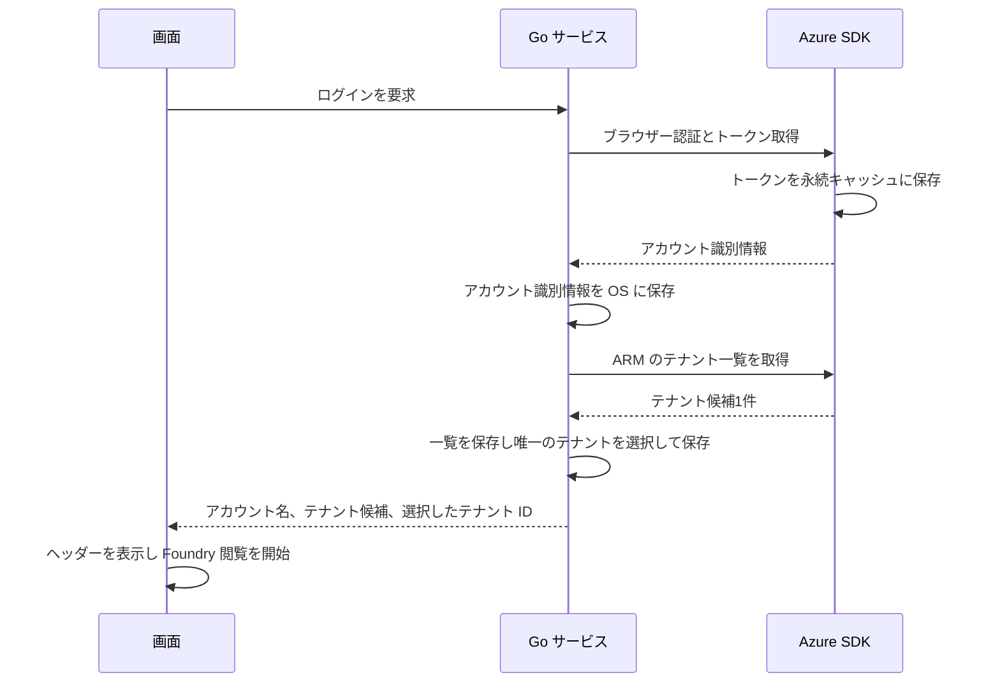
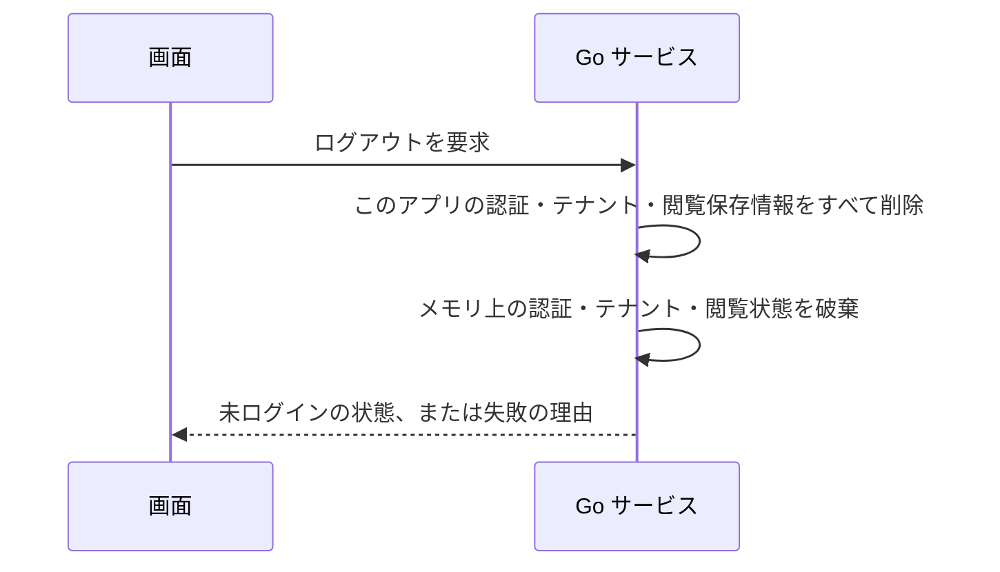
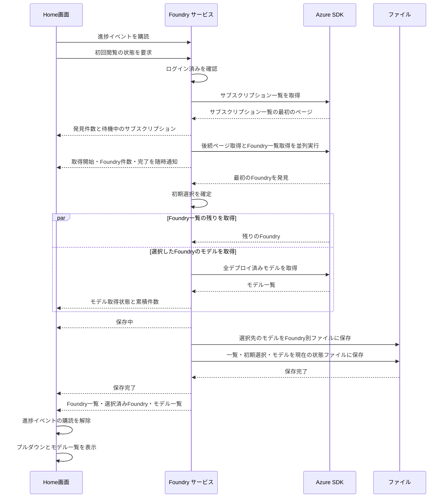

# UCP-1. 画面操作から Go サービス経由で Azure SDK を呼ぶ

適用条件と関与コンテナは [アーキテクチャの一覧](../architecture.md#patterns) を参照します。パターンからの逸脱は対象 UC ごとに本書へ記録します。図は主成功系列を役割名で示します。

| 役割 | 責務 | 実装パス |
| --- | --- | --- |
| 画面 | ボタンと状態（未ログイン・サインイン待ち・ログイン済み・失敗）の表示、ユーザーアイコンのメニューからのログアウト | `frontend/src/usecases/azure-login/AzureLogin.tsx`、`frontend/src/usecases/azure-logout/AccountMenu.tsx`、`frontend/src/features/auth/queries.ts` |
| Go サービス | ログインの実行、保存済み認証記録・テナント一覧・選択からの起動時復元、ログアウト、ログイン状態の保持、認証記録・テナント一覧・選択の同一 JSON での保存・読み出し・削除、永続キャッシュのファイル削除 | `internal/azauth/service.go`、`internal/azauth/login_record.go`、`internal/azauth/credential_manager.go`、`internal/azauth/token_cache_windows.go`、`record_store.go` |
| 起動時の接続 | アカウントと選択テナントに応じた閲覧保存先の決定、ログアウト時の全閲覧保存先と旧保存先の削除 | `main.go` |
| Azure SDK | `azidentity` によるブラウザー認証、トークン取得と永続キャッシュへの保存、永続キャッシュからのブラウザーを開かないトークン取得、ARM からのテナント一覧取得 | `internal/azauth/browser.go` |
| Home画面 | ログイン済みでの閲覧要求、検索・Foundry取得・モデル取得・保存の進捗モーダル、Foundry の選択変更、プルダウンとデプロイ済みモデルの表示、取得結果のメモリ保持 | `frontend/src/routes/index.tsx`、`frontend/src/usecases/initial-deployments/InitialDeployments.tsx`、`frontend/src/usecases/initial-deployments/AcquisitionProgressModal.tsx`、`frontend/src/features/foundry/initial-view.ts`、`frontend/src/features/foundry/change-view.ts`、`frontend/src/features/foundry/progress.ts` |
| Foundry サービス | ログイン済みの確認、保存済みファイルの読み込み、Foundry の選択と変更、一覧取得とモデル取得の並行実行、進捗イベントの通知、全取得後のファイル保存、Foundry ごとのモデル保持、結果確定 | `main.go`、`foundry_source.go`、`internal/foundry/service.go`、`internal/foundry/models.go`、`internal/foundry/progress.go`、`internal/foundry/storage.go` |
| Foundry の Azure SDK 境界 | サブスクリプション一覧と Foundry 一覧の取得、選択した Foundry の全デプロイ済みモデル取得 | `internal/foundry/azure.go` |

初回認証と保存済みログイン情報の復元では `EnableCAE: true` で ARM トークンを取得し、後続の ARM クライアントと同じ CAE 用キャッシュを使う。

## ブラウザーでAzureにサインインする

認証結果のアカウントと、Azure Resource Manager から取得した利用対象のテナント候補を区別する。認証記録のテナント ID は候補一覧と照合せず、対象テナントの決定にも使わない。ブラウザーでのサインイン時に一覧の ID・表示名を取得して保存し、通常起動時とテナント変更時には保存済みの一覧を使う。候補が1件の場合は Go サービスがそのテナントを自動選択し、一覧と選択を保存した後に画面へ返す。画面はヘッダーに選択されたテナントのプルダウンとユーザーアイコンを表示し、選択完了後に Foundry 閲覧を開始する。

入出力は `internal/azauth/service.go` の `Account`（`Username`、`Tenants`、`SelectedTenantID`）と `Tenant`（`ID`、`DisplayName`）を Wails のバインディングで生成する。候補が複数の場合の選択画面とテナント変更は未接続であり、それぞれの系列で扱う。一覧と選択の保存形式、および閲覧データのアカウント・テナント別保存範囲は [データ設計](data.md) に従う。

画面確認用の E2E ビルドでは、`internal/azauth/e2e.go` の `signIn` が固定の認証記録を返し、`listTenants` が固定の一覧を返す。固定アカウントは `operator@contoso.onmicrosoft.com`、唯一の候補は ID `e2e-azure-tenant`、表示名 `Contoso` とする。認証記録のテナント ID は `e2e-tenant` とし、候補 ID と異なる値で認証テナントへの照合に依存しないことを確認する。唯一の候補の自動選択、認証記録・一覧・選択の保存、アカウント・テナント別の閲覧保存先決定、画面の状態更新とヘッダー表示は実処理を通す。選択テナントのトークン取得だけは外部境界の固定応答を使い、資格情報マネージャーの保存先は E2E 用のファイルへ差し替える。起動・終了手順は [実行手順](../project.md#commands) を参照する。通常ビルドにも実認証・一覧取得・保存・閲覧データ分離を接続しているが、実 Azure の認証・取得と本番保存先での動作は未検証である。

起動時の復元の振る舞いは、拡張 [保存済みのログイン情報で自動的にログイン済みになる](../usecases/Azureへログインする/scenarios/保存済みのログイン情報で自動的にログイン済みになる.md) を参照する。`LoginRecord` から保存した一覧と利用対象テナントの選択を読み出し、選択したテナントのトークンだけを取得する。ARM の一覧取得は行わず、認証記録のテナント ID は選択の復元に使わない。E2E ビルドでは外部トークン取得だけを差し替え、保存済み一覧・選択の読み出しと画面の復元は実処理を通す。新しい保存形式での実 Azure による自動復元は未検証である。

ログアウトの振る舞いは、[ヘッダーのユーザーアイコンからログアウトする](../usecases/Azureからログアウトする/scenarios/ヘッダーのユーザーアイコンからログアウトする.md) を参照する。永続キャッシュは SDK に削除 API がないため、Go サービスが SDK の定めるファイルを削除する。`main.go` がすべてのアカウント・テナントの閲覧保存データと旧保存先を削除し、サービスが資格情報の認証記録・一覧・選択を削除する。成功後にメモリ上の認証・テナント・閲覧状態を破棄する。削除範囲は [データ設計](data.md#ログアウト時の削除範囲) に従う。E2E ビルドも閲覧保存データの削除は実処理を通す。全保存情報を削除する新しい実装の実機動作は未検証である。

- 整合性: 状態更新の主体 Go サービス / 結果確定点 手動ログインの認証成功はトークン取得（永続キャッシュへの保存を含む）とアカウント識別情報の保存の成功時。Foundry 閲覧の開始はテナント一覧取得と保存、対象テナントの選択と選択保存のすべての成功後。起動時の復元の成功条件は上記の拡張シナリオを参照する / 障害時の停止・継続 認証・一覧取得・保存のいずれかが失敗すれば Foundry 閲覧を開始せず、理由を画面へ返す。復元の失敗では保存情報を自動削除しない。ログアウトはすべての対象保存情報の削除とメモリ上の状態破棄が成功した時点で未ログインを確定し、いずれかが失敗すれば未ログインを確定せず理由を返す
- モックに置き換える境界と合成点: E2E 用ビルド（`e2e` タグ）では Go の外部境界 `foundry.Source` を `internal/foundry/e2e.go` と `foundry_source_e2e.go` の固定応答に差し替え、本番と同じ `InitialFoundryView` と進捗イベントを返す。初期選択・進捗の合成と通知・ファイル保存・結果表示は実処理を通し、画面側に固定タイムラインや結果の固定表を置かない。認証も同じビルドに限り、`internal/azauth/e2e.go` と `record_store_e2e.go` で Azure SDK 側のサインイン・復元・キャッシュ削除と保存先を差し替える

## デプロイモデルの初回閲覧

Home画面はログイン済みになったときに `Service.GetInitialView` を呼び、`frontend/src/usecases/initial-deployments/InitialDeployments.tsx` で Foundry とデプロイ済みモデルを表示する。サービスは保存済みファイルを先に確認し、ファイルが存在しない場合だけ以下の初回取得を行う。保存済みの場合は [再閲覧](#デプロイモデルの再閲覧) に従う。入出力の型は `internal/foundry/models.go` の `Foundry`、`Deployment`、`InitialFoundryView` を Wails のバインディングで生成し、`frontend/src/features/foundry/models.ts` から再公開する。Foundry はリソース ID で識別し、選択済み Foundry を `selectedFoundryId` で参照する。

進捗モーダルは `FoundryProgress` を受け取り、検索状態と発見件数、サブスクリプションごとの待機・取得中と Foundry 件数、完了数、選択した Foundry とモデル取得状態・件数、ファイル保存状態を表示する。完了した行は一覧から削除し、残った行の発見順を維持する。完了数と発見件数は一覧から削除した行も含めて集計する。処理中は Escape と外側クリックでも閉じない。結果取得と保存の成功後に自動で閉じる。取得失敗は既存の Home画面のエラー表示に従う。

進捗の主体は Go サービスで、`internal/foundry/progress.go` の `Progress` に検索・サブスクリプション・モデル・保存の状態をまとめ、mutex で更新と通知を直列化する。`main.go` で型付きの Wails イベント `foundry:progress` を登録し、サービスから通知する。型は Wails のバインディングで生成し、`frontend/src/features/foundry/progress.ts` から `FoundryProgress` として再公開する。初回閲覧ローダーは `GetInitialView` の呼び出し前にイベントを購読し、成功・失敗のどちらでも購読を解除する。進捗の状態は結果とは別に画面で保持する。

Go サービスはログイン済みを確認し、保存済みアカウント識別情報と永続トークンキャッシュを使う `azauth.NewSilentCredential` で Azure SDK を呼ぶ。追加のブラウザー認証は行わない。サブスクリプション検索を1本の処理で進め、各ページで見つかったサブスクリプションを発見順にキューへ追加し、「待機中」を通知する。8本の取得処理がキューから順に取り出し、「Foundry取得中」を通知して全ページを取得する。検索の後続ページ取得はこの8本とは独立して進む。Foundry 発見時にそのサブスクリプションの件数を更新し、全ページ取得後に完了を通知する。最初に発見した Foundry を一度だけ選択し、残りの Foundry の取得完了を待たずにその Foundry のデプロイ済みモデルの全ページ取得を開始する。モデルはページ取得ごとに累積件数を通知する。後から見つかった Foundry によって選択を変更しない。全取得後に保存中を通知し、ファイル保存成功後に保存完了と結果を返す。

状態更新の主体は Go サービスで、Foundry 一覧と選択した Foundry の全モデルの取得、およびファイル保存のすべてが成功した時点で結果を確定する。取得または保存に失敗した場合は部分的な結果を返さず、Home画面に `FOUNDRY_LOAD_FAILED` を表示する。保存形式と置き換え方法は [データ設計](data.md#foundry-とデプロイモデル) を参照する。取得や保存の失敗時に保存済みファイルや固定データへのフォールバックは行わない。

画面の取得結果は React Query で保持し、鮮度期限と破棄期限を無期限にする。自動再試行は行わず、ログアウト時にキャッシュを破棄する。プルダウンを開閉しても初期選択を変更しない。別の Foundry への切り替えと保存済みファイルからの復元はこの系列に含まない。画面確認用の固定データはサブスクリプション3件、Foundry 3件と選択した Foundry のデプロイ済みモデル3件で、取得処理に人工的な待ち時間を加えない。実 Azure の一覧取得と並列通信の検証には使わない。

## デプロイモデルの再閲覧

Go サービスはログイン済みを確認した後、`foundry-state.json` を読み込み、JSON を `InitialFoundryView` として復元する。ファイルが存在する場合は保存された Foundry 一覧・選択済み Foundry・モデル一覧をそのまま返す。外部取得の Source を作らず、進捗イベントを通知せず、再保存もしない。ファイルが存在しない場合だけ初回取得へ進み、読み込みや JSON の復元に失敗した場合は `FOUNDRY_LOAD_FAILED` を返す。Azure の取得や固定データへのフォールバックは行わない。保存形式は [データ設計](data.md#foundry-とデプロイモデル) を参照する。

画面は初回取得と同じローダーから Go サービスを呼び、保存された選択を維持して一覧とモデルを表示する。実際に進捗イベントを受信した場合だけ取得モーダルを表示するため、再閲覧では表示しない。再起動後も同じ保存済みファイルから復元する。画面確認用の E2E ビルドもファイルの読み込みは本番と同じ処理を通し、画面側に固定表を置かない。

## Foundryを変更し初回閲覧する

画面は `frontend/src/features/foundry/change-view.ts` から変更先のリソース ID を `Service.ChangeFoundry` に渡す。呼び出し前に既存の `foundry:progress` イベントを購読し、成功・失敗のどちらでも購読を解除する。結果は既存の `InitialFoundryView`、進捗は既存の `FoundryProgress` を使い、画面側に固定応答や人工的な待ち時間を置かない。

Go サービスはログイン済みを確認し、`foundry-state.json` に保存された Foundry 一覧に変更先が含まれることを確認する。同じ Foundry なら保存済みの閲覧結果を返し、取得・進捗通知・保存を行わない。異なる Foundry なら変更前のモデルを Foundry 別ファイルに保持する。変更先のモデルファイルが存在して読み込みに成功すれば保存内容を使い、そのモデルファイルを再保存しない。存在しない場合だけ `Source.Deployments` で全ページを取得し、モデル取得状態とページごとの累積件数、保存状態を通知して、変更先のモデルファイルを保存する。サブスクリプションと Foundry の一覧は再取得しない。

取得したモデルと保存されたモデルのどちらを使う場合も、変更先の選択とモデルを `foundry-state.json` に保存し、成功後に結果を返す。読み込み・JSON の復元・取得・保存の失敗時は既存の `FOUNDRY_LOAD_FAILED` を返し、固定応答や取得へのフォールバックは行わない。ファイルの形式と保存順序は [データ設計](data.md#foundry-とデプロイモデル) を参照する。

`AcquisitionProgressModal` は変更時にモデルと保存の状態だけを表示し、サブスクリプション検索と Foundry 一覧取得の表示を省く。処理中は元の選択とモデルを維持し、変更を受け付けない。成功後に React Query の閲覧結果を置き換える。同じ Foundry を選んだ場合はプルダウンを閉じるだけとする。モデル取得の進捗イベントが通知されない場合はモーダルを表示しない。

画面確認用の E2E ビルドでは外部取得の `foundry.Source` だけを固定応答に差し替え、変更先ごとのモデル取得、ファイルの読み込み・保存、選択の更新と進捗表示は本番と同じ処理を通す。固定応答のモデルは Production が3件、Development が3件、Research が1件で、実 Azure のモデル取得の検証には使わない。

## Foundryを変更し再閲覧する

画面は `change-view.ts` から `Service.ChangeFoundry` を呼び、上記の保存済みモデルを読み込む経路を使用する。変更先のモデルファイルを読み込み、Source の生成と進捗通知、変更先のモデルファイルの再保存は行わない。変更先の選択と読み込んだモデルを `foundry-state.json` に保存し、成功後に結果を返す。読み込みや保存の失敗時は既存の `FOUNDRY_LOAD_FAILED` で停止し、Azure の取得や固定データへのフォールバックを行わない。

画面は読み込みと状態保存の完了まで変更前の選択とモデルを維持し、成功後に閲覧結果を置き換える。進捗が通知されないためモーダルは表示しない。同じ Foundry を選んだ場合はプルダウンを閉じるだけとする。保存形式と変更前のモデル保持は [データ設計](data.md#foundry-とデプロイモデル) に従う。

画面確認用構成は `scripts/build.mjs` の起動準備で、固定の認証記録と Foundry 2件、各 Foundry のモデルファイル、Production を選択した状態ファイルを用意する。JSON は本番と同じ `InitialFoundryView` と `Deployment` の契約に従う。Go と画面の読み込み・選択更新・保存処理は差し替えず、外部取得を保留したまま、保存済みモデルだけで表示できることを確認する。固定ファイルの内容と起動・再起動の手順は [実行手順](../project.md#commands) を参照する。
