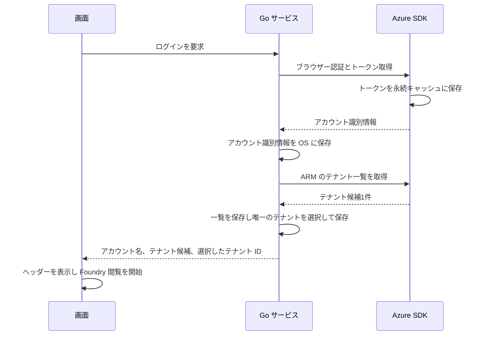
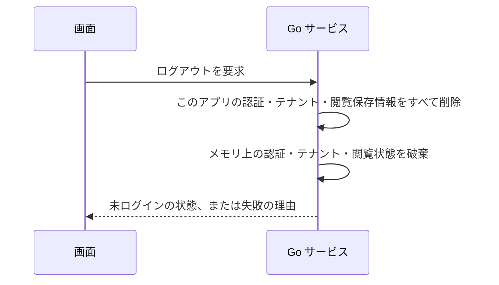
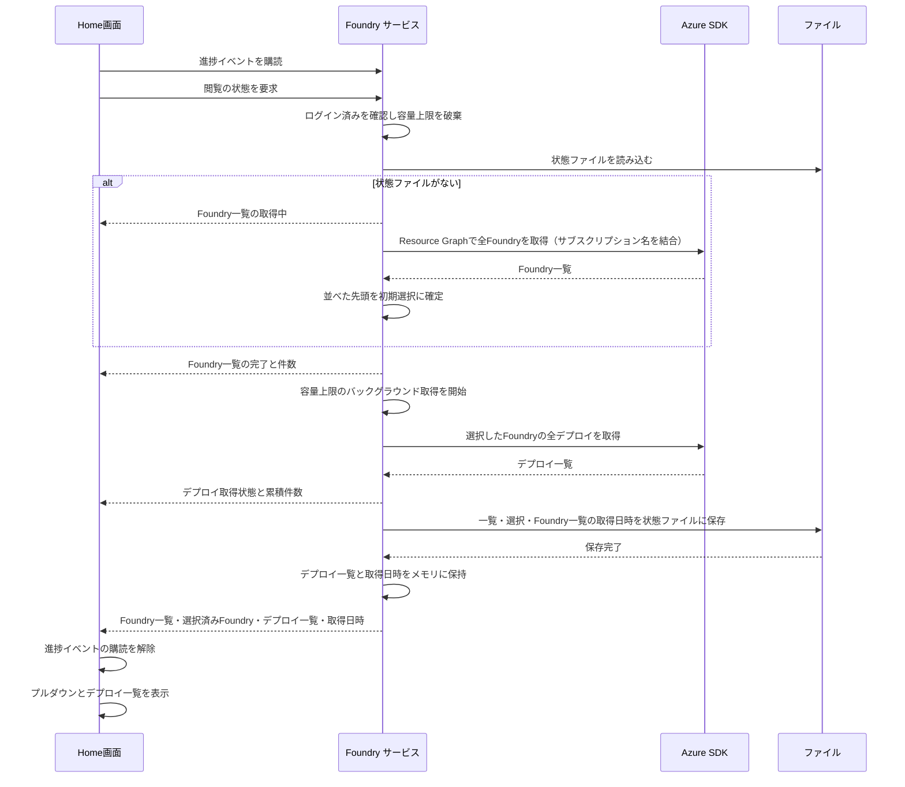
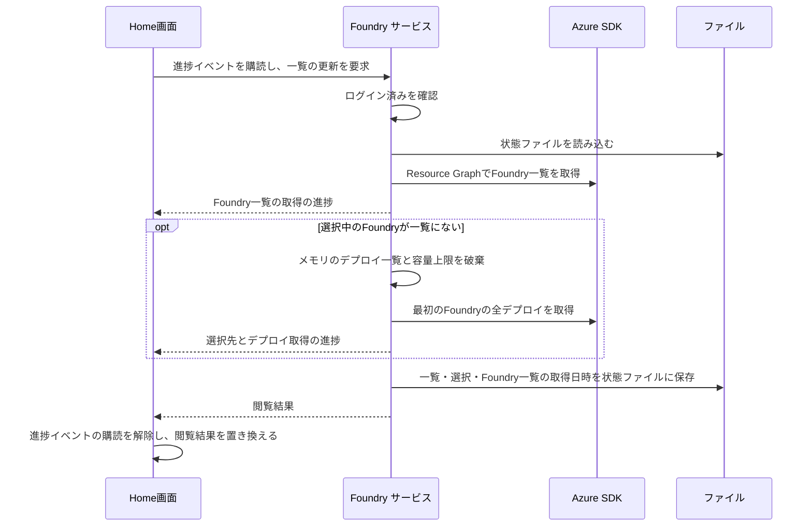
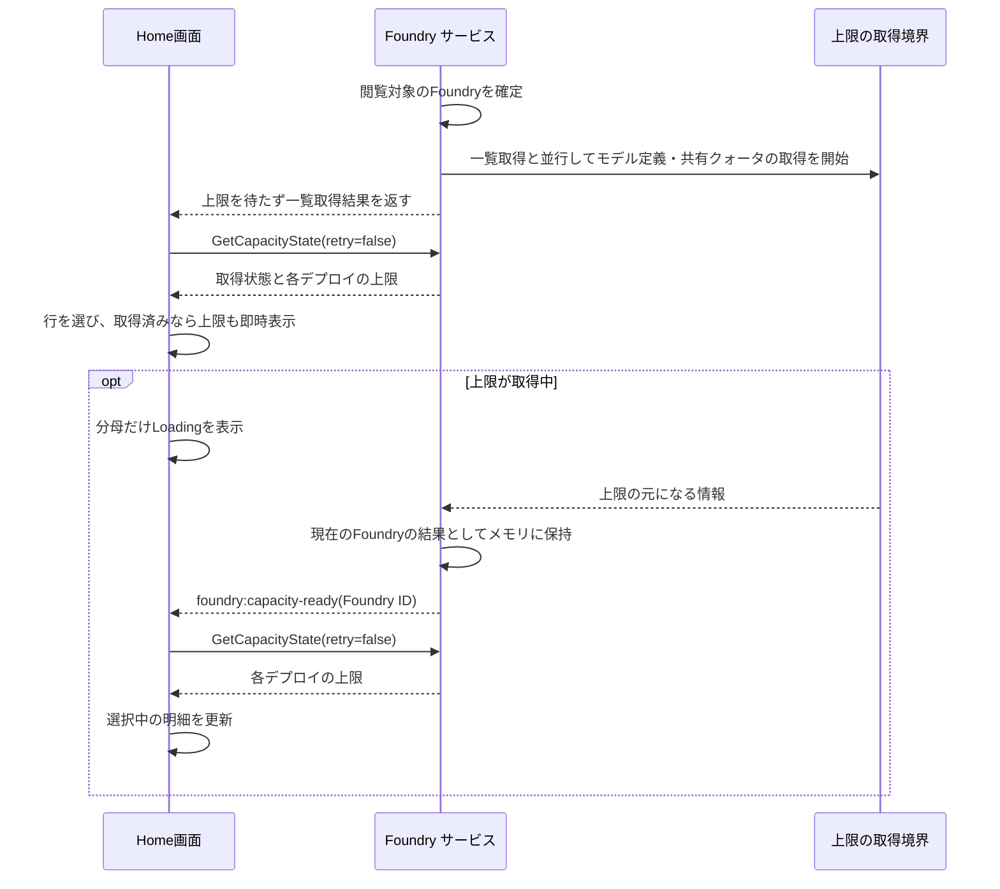
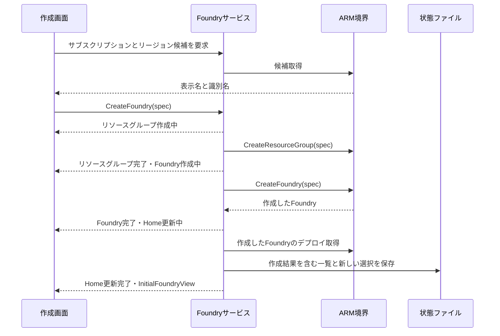
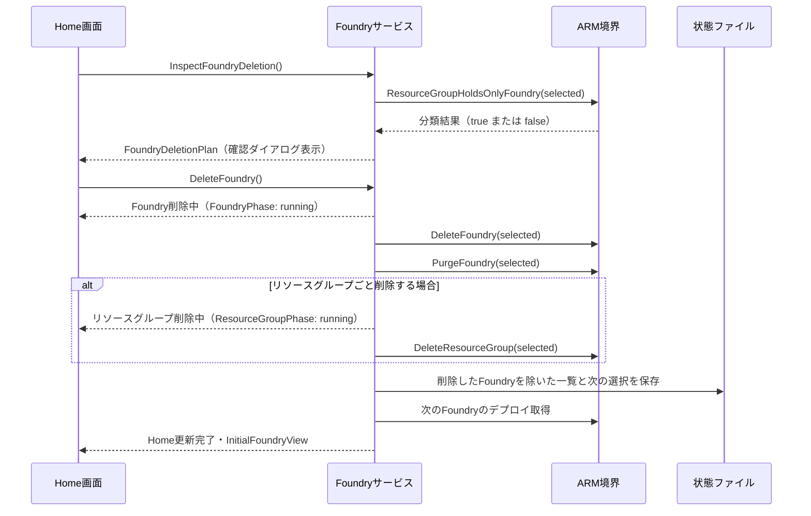

# UCP-1. 画面操作から Go サービス経由で Azure SDK を呼ぶ

適用条件と関与コンテナは [アーキテクチャの一覧](../architecture.md#patterns) を参照します。パターンからの逸脱は対象 UC ごとに本書へ記録します。図は主成功系列を役割名で示します。

| 役割 | 責務 | 実装パス |
| --- | --- | --- |
| 画面 | ボタンと状態（未ログイン・サインイン待ち・ログイン済み・失敗）の表示、ユーザーアイコンのメニューからのログアウト、ヘッダーのテナントプルダウンからのテナント変更の呼び出しと失敗バナーの表示 | `frontend/src/usecases/azure-login/AzureLogin.tsx`、`frontend/src/routes/index.tsx`、`frontend/src/shared/ErrorNotice.tsx`、`frontend/src/usecases/azure-logout/AccountMenu.tsx`、`frontend/src/features/auth/queries.ts` |
| Go サービス | ログインの実行、保存済み認証記録・テナント一覧・選択からの起動時復元、ログイン済みでのテナント変更（変更先のトークン取得と選択保存）、ログアウト、ログイン状態の保持、認証記録・テナント一覧・選択の同一 JSON での保存・読み出し・削除、永続キャッシュのファイル削除 | `internal/azauth/service.go`、`internal/azauth/login_record.go`、`internal/azauth/credential_manager.go`、`internal/azauth/token_cache_windows.go`、`record_store.go` |
| 起動時の接続 | アカウントと選択テナントに応じた閲覧保存先の決定、ログアウト時の全閲覧保存先と旧保存先の削除 | `main.go` |
| Azure SDK | `azidentity` によるブラウザー認証、トークン取得と永続キャッシュへの保存、永続キャッシュからのブラウザーを開かないトークン取得、ARM からのテナント一覧取得 | `internal/azauth/browser.go` |
| Home画面 | ログイン済みでの閲覧要求、Foundry 一覧・デプロイ一覧の取得の進捗モーダル、Foundry の選択変更と Foundry 一覧・デプロイモデル・利用金額の更新、プルダウンとデプロイ済みモデル・最終取得日時の表示、取得結果のメモリ保持 | `frontend/src/routes/index.tsx`、`frontend/src/usecases/initial-deployments/InitialDeployments.tsx`、`frontend/src/usecases/initial-deployments/AcquisitionProgressModal.tsx`、`frontend/src/features/foundry/initial-view.ts`、`frontend/src/features/foundry/change-view.ts`、`frontend/src/features/foundry/refresh-view.ts`、`frontend/src/features/foundry/refresh-deployments.ts`、`frontend/src/features/foundry/progress.ts`、`frontend/src/usecases/initial-deployments/FoundryConnection.tsx`、`frontend/src/features/foundry/connection.ts`、`frontend/src/usecases/initial-deployments/SubscriptionCost.tsx`、`frontend/src/usecases/initial-deployments/RefreshIcon.tsx`、`frontend/src/features/foundry/cost.ts` |
| Foundry サービス | ログイン済みの確認、状態ファイル（Foundry 一覧と選択）の読み込みと保存、Foundry の選択と変更、Foundry 一覧の更新、選択中の Foundry のデプロイ一覧の取得とメモリ保持、進捗イベントの通知、デプロイ一覧の取得後の状態ファイル保存、容量上限・接続情報・利用金額の取得とメモリ保持、結果確定 | `main.go`、`foundry_source.go`、`internal/foundry/service.go`、`internal/foundry/detail.go`、`internal/foundry/connection.go`、`internal/foundry/cost.go`、`internal/foundry/models.go`、`internal/foundry/progress.go`、`internal/foundry/storage.go` |
| Foundry の Azure SDK 境界 | Azure Resource Graph による Foundry 一覧の取得（サブスクリプション名の結合を含む）、選択した Foundry の全デプロイ（SKU・容量・状態・更新ポリシーを含む）の取得、容量上限の元になるモデル定義と共有クォータの取得、エンドポイント（Accounts Get）とキー（Accounts ListKeys）の並列取得、Azure Cost Management によるサブスクリプションの当月の実コストの取得 | `internal/foundry/azure.go`、`internal/foundry/azure_limits.go`、`internal/foundry/azure_connection.go`、`internal/foundry/azure_cost.go` |
| Foundry 作成画面とサービス | サブスクリプション・リージョン候補の表示、命名と直接編集、作成要求、3段階の進捗表示、作成結果による一覧と選択の更新・保存 | `frontend/src/usecases/initial-deployments/AddFoundryModal.tsx`、`frontend/src/usecases/initial-deployments/CreateFoundryProgressModal.tsx`、`frontend/src/features/foundry/create-foundry.ts`、`internal/foundry/create_foundry.go` |
| Foundry 作成の Azure SDK 境界 | Enabled サブスクリプションの取得、AIServices／S0 のリージョンと制限の照合、既存リソースの事前確認、リソースグループと Foundry の作成・完了待機 | `internal/foundry/azure_create_foundry.go` |

初回認証と保存済みログイン情報の復元では `EnableCAE: true` で ARM トークンを取得し、後続の ARM クライアントと同じ CAE 用キャッシュを使う。

## ブラウザーでAzureにサインインする

認証結果のアカウントと、Azure Resource Manager から取得した利用対象のテナント候補を区別する。認証記録のテナント ID は候補一覧と照合せず、対象テナントの決定にも使わない。ブラウザーでのサインイン時に一覧の ID・表示名を取得して保存し、通常起動時とテナント変更時には保存済みの一覧を使う。候補が1件の場合は Go サービスがそのテナントを自動選択し、一覧と選択を保存した後に画面へ返す。画面はヘッダーに選択されたテナントのプルダウンとユーザーアイコンを表示し、選択完了後に Foundry 閲覧を開始する。

入出力は `internal/azauth/service.go` の `Status`（`Phase`、`Account`）、`Account`（`Username`、`Tenants`、`SelectedTenantID`）、`Tenant`（`ID`、`DisplayName`）を Wails のバインディングで生成し、単一テナントと複数テナントの系列で共有する。テナント変更は未接続であり、別の系列で扱う。一覧と選択の保存形式、および閲覧データのアカウント・テナント別保存範囲は [データ設計](data.md) に従う。

画面確認用の E2E ビルドでは、`internal/azauth/e2e.go` の `signIn` が固定の認証記録を返し、`listTenants` が固定の一覧を返す。固定アカウントは `operator@contoso.onmicrosoft.com`、唯一の候補は ID `e2e-azure-tenant`、表示名 `Contoso` とする。認証記録のテナント ID は `e2e-tenant` とし、候補 ID と異なる値で認証テナントへの照合に依存しないことを確認する。唯一の候補の自動選択、認証記録・一覧・選択の保存、アカウント・テナント別の閲覧保存先決定、画面の状態更新とヘッダー表示は実処理を通す。選択テナントのトークン取得だけは外部境界の固定応答を使い、資格情報マネージャーの保存先は E2E 用のファイルへ差し替える。起動・終了手順は [実行手順](../project.md#commands) を参照する。通常ビルドは実 Azure の認証・一覧取得・選択先トークン取得と本番保存先を使い、画面確認用構成はこれらの外部境界を差し替える。

## サインイン時に複数テナントが存在する

`Login` が認証記録とテナント一覧を保存した後、候補が2件以上なら `Status.Phase` を `selectingTenant` とし、`Account.Tenants` に一覧、`Account.SelectedTenantID` に空文字列を返す。認証済みと選択完了を区別し、画面はログインモーダルを閉じられないテナント選択画面に切り替える。初期状態は未選択で、選択するまで確定ボタンを無効にする。選択完了前には Foundry の閲覧を開始しない。

画面は候補の ID を `SelectTenant(tenantID)` に渡して選択を確定する。Go サービスが選択先のトークンを取得し、既存の `tenants` と `selectedTenantId` の保存形式で選択を保存する。成功後に `signedIn` の `Status` を返し、画面は Home と選択したテナントのプルダウン、ユーザーアイコンを表示する。選択保存に失敗した場合は `selectingTenant` のまま画面にエラーを返し、画面の選択値を保持して再試行できるようにする。

画面確認用の E2E ビルドでは、認証と `listTenants` の外部境界を固定応答へ差し替え、一覧は7件とする。未選択状態の確定、`SelectTenant` の処理、選択保存、画面の状態更新は通常と同じ処理を通し、選択先のトークン取得だけを外部境界の固定応答とする。起動・終了と固定候補の確認手順は [実行手順](../project.md#commands) を参照する。ログイン後に対象テナントを変更する処理はこの系列に含めない。

## 保存済みログイン情報の復元とログアウト

起動時の復元の振る舞いは、拡張 [保存済みのログイン情報で自動的にログイン済みになる](../usecases/Azureへログインする/scenarios/保存済みのログイン情報で自動的にログイン済みになる.md) を参照する。`LoginRecord` から保存した一覧と利用対象テナントの選択を読み出し、選択したテナントのトークンだけを取得する。ARM の一覧取得は行わず、認証記録のテナント ID は選択の復元に使わない。E2E ビルドでは外部トークン取得だけを差し替え、保存済み一覧・選択の読み出しと画面の復元は実処理を通す。通常ビルドの再起動でも保存済み一覧と選択を使い、同じアカウント・テナントの閲覧保存先から Foundry 一覧と選択を復元し、デプロイ一覧は Azure から取得する。

ログアウトの振る舞いは、[ヘッダーのユーザーアイコンからログアウトする](../usecases/Azureからログアウトする/scenarios/ヘッダーのユーザーアイコンからログアウトする.md) を参照する。ログアウト開始時に、認証サービスの `stopView(false)` コールバックから `main.go` を通して `foundry.StopView` を呼び、進行中の容量上限取得をキャンセルして終了を待つ。永続キャッシュは SDK に削除 API がないため、Go サービスが SDK の定めるファイルを削除する。`main.go` がすべてのアカウント・テナントの閲覧保存データと旧保存先を削除し、サービスが資格情報の認証記録・一覧・選択を削除する。すべての削除に成功した後に `stopView(true)` を呼び、メモリ上の認証・テナント・閲覧状態を破棄する。削除失敗時はデプロイ一覧と取得済みの容量上限情報を保持する。`foundry.StopView` はパッケージ内の接続に使い、Wails へ公開しない。削除範囲は [データ設計](data.md#ログアウト時の削除範囲) に従う。E2E ビルドも閲覧保存データの削除は実処理を通す。全保存情報を削除する新しい実装の実機動作は未検証である。

- 整合性: 状態更新の主体 Go サービス / 結果確定点 手動ログインの認証成功はトークン取得（永続キャッシュへの保存を含む）とアカウント識別情報の保存の成功時。Foundry 閲覧の開始はテナント一覧取得と保存、対象テナントの選択と選択保存のすべての成功後。起動時の復元の成功条件は上記の拡張シナリオを参照する / 障害時の停止・継続 認証・一覧取得・保存のいずれかが失敗すれば Foundry 閲覧を開始せず、理由を画面へ返す。復元の失敗では保存情報を自動削除しない。ログアウトはすべての対象保存情報の削除とメモリ上の状態破棄が成功した時点で未ログインを確定し、いずれかが失敗すれば未ログインを確定せず理由を返す
- モックに置き換える境界と合成点: E2E 用ビルド（`e2e` タグ）では Go の外部境界 `foundry.Source` を `internal/foundry/e2e.go` と `foundry_source_e2e.go` の固定応答に差し替え、本番と同じ `InitialFoundryView` と進捗イベントを返す。初期選択・進捗の合成と通知・Foundry 一覧と選択のファイル保存・結果表示は実処理を通し、画面側に固定タイムラインや結果の固定表を置かない。認証も同じビルドに限り、`internal/azauth/e2e.go` と `record_store_e2e.go` で Azure SDK 側のサインイン・復元・キャッシュ削除と保存先を差し替える

## デプロイモデルを閲覧する

Home画面はログイン済みになったときに `Service.GetInitialView` を呼び、`frontend/src/usecases/initial-deployments/InitialDeployments.tsx` で Foundry とデプロイ済みモデルを表示する。サービスはまず、メモリに保持した容量上限を破棄する。状態ファイルが存在しなければ Foundry 一覧を取得して先頭を選択し、存在すれば保存された Foundry 一覧と選択を復元する。どちらの場合も、選択中の Foundry のデプロイ一覧は保存せず、毎回 Azure から取得してメモリに保持する。対象 Foundry の確定時に、明細の設計に従って容量上限のバックグラウンド取得も同時に開始する。入出力の型は `internal/foundry/models.go` の `Foundry`、`Deployment`、`InitialFoundryView` を Wails のバインディングで生成し、`frontend/src/features/foundry/models.ts` から再公開する。Foundry はリソース ID で識別し、選択済み Foundry を `selectedFoundryId` で参照する。`Deployment` は `id`、`deploymentName`、`modelName`、`version` に加え、一覧から得る `skuName`、`capacity`、`capacityUnit`、`provisioningState`、`versionUpgradePolicy` を持つ。Azure が返さない項目は `null` とする。

進捗モーダルは `FoundryProgress` を受け取り、「Foundries」と「Deployments」の2行を、開いた時点から完了まで固定の高さで表示する。各行は待機中・取得中・完了と回転表示、行の右側の結果（Foundry 件数、選択した Foundry の名称とデプロイ件数）を示す。保存済みの一覧を復元する場合は、「Foundries」を最初から完了として件数を示す。行の増減や経過時間の表示はしない。状態ファイルの保存は一瞬のため進捗に表さない。処理中は Escape と外側クリックでも閉じない。結果取得と保存の成功後に自動で閉じる。取得失敗は既存の Home画面のエラー表示に従う。

進捗の主体は Go サービスで、`internal/foundry/progress.go` の `Progress` に Foundry 一覧・デプロイの各状態（待機中・取得中・完了）と Foundry 件数、選択先の名称、デプロイ件数をまとめ、状態の変化ごとに通知する。Foundry 一覧・デプロイ一覧の進捗通知は直列に行う。容量上限のバックグラウンド取得は別の状態と完了通知で管理する。`main.go` で型付きの Wails イベント `foundry:progress` を登録し、サービスから通知する。型は Wails のバインディングで生成し、`frontend/src/features/foundry/progress.ts` から `FoundryProgress` として再公開する。閲覧ローダーは `GetInitialView` の呼び出し前にイベントを購読し、成功・失敗のどちらでも購読を解除する。進捗の状態は結果とは別に画面で保持する。

Go サービスはログイン済みを確認し、保存済みアカウント識別情報と永続トークンキャッシュを使う `azauth.NewSilentCredential` で Azure SDK を呼ぶ。追加のブラウザー認証は行わない。Foundry 一覧は Azure Resource Graph（`POST https://management.azure.com/providers/Microsoft.ResourceGraph/resources`）への1回のクエリで取得する。クエリは `resources` から種別が `microsoft.cognitiveservices/accounts` かつ `kind` が `AIServices` のものを選び、`resourcecontainers` の `microsoft.resources/subscriptions` と `subscriptionId` で結合してサブスクリプション名を得る。結果は `skipToken` で全ページ取得し、サブスクリプション名、Foundry 名の昇順に並べる。一覧の取得を完了してから、先頭の Foundry を選択し、そのデプロイの全ページ取得を始める。デプロイはページ取得ごとに累積件数を通知する。取得後に Foundry 一覧と選択を状態ファイルへ保存し、成功後に結果を返す。参照可能な Foundry が0件の場合はデプロイを取得しない。

状態更新の主体は Go サービスで、Foundry 一覧（状態ファイルがない場合）と選択した Foundry の全デプロイの取得、および状態ファイルの保存のすべてが成功した時点で結果を確定する。Resource Graph の結果は Azure 上の変更から遅れることがあり、実測では作成が約0.6秒、削除が約9.3秒で反映された（[確認した事実](../project.md#design)）。取得または保存に失敗した場合は部分的な結果を返さず、Home画面に `FOUNDRY_LOAD_FAILED` を表示する。保存形式は [データ設計](data.md#foundry-とデプロイモデル) を参照する。取得や保存の失敗時に固定データへのフォールバックは行わない。

選択中の Foundry の接続情報（Azure OpenAI エンドポイントと API キー Key1）は、容量上限と同じく対象 Foundry の確定時にデプロイ一覧の取得と並行してバックグラウンドで取得し、`Service` のメモリだけに保持する。エンドポイントは Accounts Get の `properties.endpoints` の `OpenAI Language Model Instance API` の値（[確認した事実](../project.md#design)）の末尾のスラッシュを除き、`/openai/v1` を付けた v1 API のベース URL とする。キーは Accounts ListKeys の `key1` を使う。保持状態の破棄と完了通知、古い取得結果を反映しない規則は容量上限と同じとし、一覧取得と保存の完了は接続情報の取得を待たない。画面は取得状態とエンドポイント・キーの全文を参照し、キーは伏せ字と末尾4文字に変換して表示する。コピーはクリップボードへ全文を書き込む。キーはファイル・ログ・エラーメッセージへ出さない。入出力は `internal/foundry/connection.go` の `Connection`（`Endpoint`、`Key`）と `ConnectionState`（`FoundryID`、`Loading`、`Connection`）とし、画面は `Service.GetConnectionState` で取得完了を待たずに参照し、`foundry:connection-ready`（対象 Foundry のリソース ID）で参照し直す。画面は `frontend/src/usecases/initial-deployments/FoundryConnection.tsx` とする。画面確認用の E2E ビルドでは `fixedSource.Connection` が `https://<Foundry 名>.openai.azure.com/openai/v1` と、末尾が Foundry ごとに異なる固定のキー（Production `prd1`、Development `dev1`、Research `rsc1`）を返し、`AZFOUNDRYDECK_E2E_CAPACITY_REVIEW=1` では容量上限と同じく4秒遅延する。ゲート `connection` は E2E テストのためにこの取得を保留する。

選択中の Foundry のサブスクリプションの当月の利用金額は、接続情報と同じく対象 Foundry の確定時にデプロイ一覧の取得と並行してバックグラウンドで取得し、`Service` のメモリだけに保持する。「Refresh models」では取得し直さない。「Refresh cost」ボタンは `Service.RefreshCost` を呼び、状態ファイルの選択中の Foundry について前回の取得を中止して取得し直す。デプロイ一覧・容量上限・接続情報・状態ファイルには触れない。`RefreshCost` 自体の失敗（ログイン状態や状態ファイルの読み込み）も `COST_LOAD_FAILED` として金額の位置に表示する。保持状態の破棄と完了通知、古い取得結果を反映しない規則は接続情報と同じとし、一覧取得と保存の完了は利用金額の取得を待たない。入出力は `internal/foundry/cost.go` の `Cost`（`Amount`、`Currency`）と `CostState`（`FoundryID`、`Loading`、`Cost`、`Error`）とし、画面は `Service.GetCostState` で取得完了を待たずに参照し、`foundry:cost-ready`（対象 Foundry のリソース ID）で参照し直す。この通知は取得の開始時と完了時に送り、画面が取得中の状態を読み直せるようにする。ボタンのアイコンは既存の更新ボタンと同じ `RefreshIcon.tsx` を使う。失敗時は `Error` に `COST_LOAD_FAILED` を入れ、原因は診断ログにだけ記録する。画面は `frontend/src/usecases/initial-deployments/SubscriptionCost.tsx` とし、円は1円未満を四捨五入して `¥` を付け、それ以外は小数2桁と通貨コードで表示する。外部取得は `internal/foundry/azure_cost.go` の `azureSource.Cost` が担い、`armcostmanagement` の `QueryClient.Usage` でサブスクリプションを範囲に、種別 `ActualCost`、期間 `MonthToDate`、`Cost` の合計を1回問い合わせ、応答の `Cost` 列と `Currency` 列を返す。行が0件の場合は金額0・通貨なしとし、画面は `0` を表示する。要求回数の制限（429）は、応答の `x-ms-ratelimit-microsoft.costmanagement-entity-retry-after` が示す秒数に1秒を足して待ってから問い合わせ直し、最大3回まで繰り返す。Azure SDK の既定の再試行はこのヘッダーを読まず、即時の再試行が制限を消費するため、この問い合わせでは 429 を SDK の再試行の対象から外す。3回の後も 429 の場合は `COST_LOAD_FAILED` とする（[確認した事実](../project.md#design)）。待機は Foundry の変更や「Refresh cost」で前の取得を中止すると終わる。画面確認用の E2E ビルドでは `fixedSource.Cost` がサブスクリプションごとに固定の値を返す（`review-production` は `12345.6 JPY`、`review-development` は `1234.56 USD`、`review-research` は失敗、それ以外は利用なしの金額0・通貨なし）。`AZFOUNDRYDECK_E2E_CAPACITY_REVIEW=1` では接続情報と同じく4秒遅延する。ゲート `cost` は E2E テストのためにこの取得を保留する。

画面の取得結果は React Query で保持し、鮮度期限と破棄期限を無期限にする。自動再試行は行わず、ログアウト時にキャッシュを破棄する。プルダウンを開閉しても選択を変更しない。画面確認用の固定データは Foundry 3件と選択した Foundry のデプロイ済みモデル3件（モデルごとの固定の SKU・容量・状態・更新ポリシーを持つ）で、取得処理に人工的な待ち時間を加えない。実 Azure の一覧取得の検証には使わない。

## Foundryを変更し閲覧する

画面は `frontend/src/features/foundry/change-view.ts` から変更先のリソース ID を `Service.ChangeFoundry` に渡す。呼び出し前に既存の `foundry:progress` イベントを購読し、成功・失敗のどちらでも購読を解除する。結果は既存の `InitialFoundryView`、進捗は既存の `FoundryProgress` を使い、画面側に固定応答や人工的な待ち時間を置かない。

Go サービスはログイン済みを確認し、状態ファイルの Foundry 一覧に変更先が含まれることを確認する。同じ Foundry なら現在の閲覧結果を返し、取得・進捗通知・保存を行わない。異なる Foundry なら、メモリに保持した変更前のデプロイ一覧と容量上限を破棄し、変更先の容量上限のバックグラウンド取得を開始する。同時に `Source.Deployments` で変更先の全ページを取得して、デプロイ取得状態とページごとの累積件数を通知する。Foundry の一覧は再取得しない。取得したデプロイ一覧と取得日時はメモリに保持し、変更先の選択を状態ファイルに保存して、成功後に結果を返す。変更前の Foundry のデプロイ一覧は保持しないため、変更前の Foundry に戻す場合も取得し直す。取得・保存の失敗時は既存の `FOUNDRY_LOAD_FAILED` を返し、固定応答や取得へのフォールバックは行わない。ファイルの形式は [データ設計](data.md#foundry-とデプロイモデル) を参照する。

`AcquisitionProgressModal` は変更時に「Deployments」の1行だけを表示し、Foundry 一覧取得の行を省く。処理中は元の選択とデプロイ一覧を維持し、変更を受け付けない。成功後に React Query の閲覧結果を置き換える。同じ Foundry を選んだ場合はプルダウンを閉じるだけとする。

画面確認用の E2E ビルドでは外部取得の `foundry.Source` だけを固定応答に差し替え、変更先ごとのデプロイ取得、状態ファイルの読み込み・保存、選択の更新と進捗表示は本番と同じ処理を通す。固定応答のデプロイは Production が3件、Development が3件、Research が1件で、実 Azure のデプロイ取得の検証には使わない。

## Foundry一覧を更新する

この処理は、[Foundry一覧を更新する](../usecases/Foundry一覧を更新する/scenarios/Foundry一覧を更新する.md)と[Foundry一覧の更新で選択先が変わる](../usecases/Foundry一覧を更新する/scenarios/Foundry一覧の更新で選択先が変わる.md)の両シナリオで共用する。

画面は `frontend/src/features/foundry/refresh-view.ts` から `Service.RefreshFoundries` を呼ぶ。呼び出し前に既存の `foundry:progress` イベントを購読し、成功・失敗のどちらでも購読を解除する。結果は既存の `InitialFoundryView`、進捗は既存の `FoundryProgress` を使う。

Go サービスはログイン済みを確認し、状態ファイルを読み込んだ後、閲覧と同じ `Source.Foundries` で Foundry 一覧を取得し、「Foundries」の状態と件数を通知する。一覧が空の場合は、[Foundryが存在しない状態へ一覧を更新する](#foundryが存在しない状態へ一覧を更新する) の扱いに従う。選択中の Foundry が更新後の一覧に含まれる場合は選択、メモリのデプロイ一覧とその取得日時、容量上限を維持し、デプロイを取得しない。含まれない場合は、メモリのデプロイ一覧と容量上限を破棄し、一覧の最初の Foundry を選択して容量上限のバックグラウンド取得を開始し、同時に `Source.Deployments` で全ページを取得し、選択先の名称・デプロイ取得状態・累積件数を通知する。選択中の Foundry が残る場合、「Deployments」は待機中のまま保存へ進む。

最後に Foundry 一覧・選択・Foundry 一覧の取得日時を状態ファイルに保存し、成功後に結果を返す。取得・保存のいずれかが失敗した場合は既存の `FOUNDRY_LOAD_FAILED` を返し、固定データや保存済みファイルへのフォールバックは行わない。取得日時は [データ設計](data.md#foundry-とデプロイモデル) を参照する。

`AcquisitionProgressModal` は `refresh` の表示で題名を「Refreshing Foundries」とし、Foundry 一覧とデプロイの2行を最初から表示して、デプロイの行は選択先が変わる場合だけ取得中にする。処理中は元の一覧・選択・デプロイ一覧を維持し、プルダウンと更新ボタンを無効にする。最終取得日時は `InitialFoundryView` の `foundriesFetchedAt` と `deploymentsFetchedAt` を、画面でローカル時刻の `YYYY-MM-DD HH:mm` に変換して表示する。

画面確認用構成は `scripts/build.mjs` の起動準備で、固定の認証記録と、Production・Development・Legacy の Foundry 一覧、Production を選択した状態ファイルを用意する（Foundry 一覧の取得日時は `2026-09-01T09:00:00+09:00`）。外部取得の `foundry.Source` だけを E2E 用の固定応答（Production・Development・Research）に差し替え、一覧の更新・デプロイ取得・状態ファイルの保存・進捗表示は本番と同じ処理を通す。実 Azure の一覧取得の検証には使わない。

## デプロイモデルを更新する

画面は `frontend/src/features/foundry/refresh-deployments.ts` から `Service.RefreshDeployments` を呼ぶ。呼び出し前に既存の `foundry:progress` イベントを購読し、成功・失敗のどちらでも購読を解除する。結果は既存の `InitialFoundryView`、進捗は既存の `FoundryProgress` を使う。

Go サービスはログイン済みを確認し、状態ファイルを読み込んで選択中の Foundry を一覧から特定する。`Source.Deployments` で全ページを取得し、デプロイ取得状態とページごとの累積件数を通知する。取得したデプロイ一覧と取得日時でメモリを置き換え、状態ファイルを保存して結果を返す。Foundry の一覧は再取得せず、メモリの容量上限は取り直さない。取得・通知・保存は Foundry を変更して閲覧する場合と同じ `acquireModels` を使う。取得・保存の失敗時は既存の `FOUNDRY_LOAD_FAILED` を返し、固定データへのフォールバックは行わない。取得日時は [データ設計](data.md#foundry-とデプロイモデル) を参照する。

`AcquisitionProgressModal` は `deployments` の表示で題名を「Refreshing models」とし、デプロイ取得の行だけを表示する。処理中は元のデプロイ一覧を維持し、プルダウンと両方の更新ボタンを無効にする。成功後に React Query の閲覧結果を置き換え、表示中の明細を破棄する。

画面確認用構成は Foundry一覧の更新と同じ状態ファイルを用意し、外部取得の `foundry.Source` だけを E2E 用の固定応答（Production のデプロイ3件）に差し替える。デプロイ取得・進捗表示は本番と同じ処理を通す。実 Azure のデプロイ取得の検証には使わない。

## テナントを変更し閲覧する

画面は、ヘッダーのテナントプルダウンで現在と異なるテナントが選ばれたときだけ `features/auth/queries.ts` の `useChangeTenant` から `Service.ChangeTenant` にテナント ID を渡す。同じテナントを選んだ場合は呼び出さない。呼び出し中は `changeTenantKey` のミューテーションとして扱い、プルダウンと、Home の Foundry 変更・Foundry 一覧の更新・デプロイの更新の各操作を無効にする。失敗は `routes/index.tsx` が `ErrorNotice` のバナーとしてページ本文の先頭に表示し、右上の「×」で閉じる。

Go サービスはログイン済みであることを確認し、同じテナントなら現在の状態をそのまま返す。異なるテナントなら、保存済みのテナント一覧に含まれることを確認し、変更先の選択を持つ認証記録でトークンをブラウザーを開かずに取得してから、その認証記録を保存する。トークン取得と保存の両方に成功した後にだけ `stopView(true)` を呼び、変更前の容量上限取得をキャンセルして終了を待ち、閲覧のメモリ状態を破棄してから認証サービスの状態を更新する。失敗時は変更前の選択と状態を維持し、`SELECT_TENANT_FAILED` を返す。無効なテナント ID は `INVALID_TENANT`、ログイン前は `NOT_SIGNED_IN` を返す。

成功後、画面は React Query の Foundry 関連の結果を破棄して状態を置き換える。Home は [閲覧](#デプロイモデルを閲覧する) を、変更先のアカウント・テナントの閲覧保存先に対して行う。変更前のメモリのデプロイ一覧と容量上限はテナント変更の成功時に破棄済みであり、閲覧の開始時にも容量上限の保持状態を初期化する。変更先に保存済みの Foundry 一覧と選択があれば、それを復元してデプロイ一覧と容量上限を並行して取得し、なければ Foundry 一覧から取得する。どちらも進捗モーダルを使う。変更前のテナントの閲覧保存先は変更しない。閲覧に失敗した場合の表示は既存の `FOUNDRY_LOAD_FAILED` に従う。

画面確認用の E2E ビルドでは、トークン取得と一覧取得の外部境界だけを固定応答に差し替える。確認用起動 `server:review:tenant-change` は、テナント3件（Contoso、Fabrikam、Northwind）の認証記録を置く。確認用起動 `server:review:tenant-revisit` は、`Fabrikam` の閲覧保存先に Foundry 2件（2件目を選択）の状態ファイルを用意する。実 Azure でのトークン取得は検証対象に含めない。

## Foundryが存在しない状態で閲覧する

閲覧の取得は、Foundry 一覧の取得が成功し、参照可能な Foundry が1件もなかった場合を、エラーにせず正常な結果として扱う。Go サービスの `acquire` は、一覧の取得が終わるまで最初の Foundry が見つからなかったことを、選択先がない結果（エラーなし）として返し、デプロイを取得しない。空の一覧、選択なし（`selectedFoundryId` は空文字列）、空のデプロイ一覧、Foundry 一覧の取得日時だけを状態ファイルに保存し、保存の成功後に結果を返す。取得または保存に失敗した場合は既存の `FOUNDRY_LOAD_FAILED` を返す。次の閲覧で保存済みの空の一覧を復元した場合も、Foundry 一覧とデプロイ一覧を取得せず同じ結果を返す。

画面は、`foundries` が空の結果を受け取ると、特別な案内を出さず、選択なしの Foundry のプルダウン（選択肢なし）と、空のデプロイ済みモデルの一覧（0 件）を表示する。選択中の Foundry がないため「Refresh models」ボタンは無効にし、デプロイ一覧の最終取得日時は表示しない。「Refresh Foundries」ボタンと Foundry 一覧の最終取得日時は通常どおり表示する。進捗モーダルは通常の閲覧と同じ表示とする。

画面確認用の E2E ビルドでは、外部取得の `foundry.Source` だけを固定応答に差し替える。`AZFOUNDRYDECK_E2E_FOUNDRIES=none` のとき、一覧の取得は Foundry を返さない。保存・読み込み・表示は本番と同じ処理を通す。「Refresh Foundries」で再取得した結果が0件の場合の扱いは、次の節で定める。

## Foundryが存在しない状態へ一覧を更新する

Foundry 一覧の更新で、Foundry 一覧の取得が成功し、参照可能な Foundry が1件もなかった場合は、エラーにせず正常な結果として扱う。Go サービスの `refresh` は、更新後の一覧を空にし、選択を空文字列、デプロイ一覧を空、デプロイの取得日時を空文字列にして、メモリのデプロイ一覧と容量上限を破棄し、デプロイを取得しない。空の一覧と Foundry 一覧の取得日時を状態ファイルに保存した後、結果を返す。取得・保存のいずれかが失敗した場合は既存の `FOUNDRY_LOAD_FAILED` を返し、保存が成功するまで更新前の一覧・選択・デプロイ一覧を維持する。保存形式は [データ設計](data.md#foundry-とデプロイモデル) の0件の場合と同じである。

画面は、既存の更新と同じ進捗モーダルを使い、選択先がないためデプロイの行は待機中のままにする。成功後は React Query の結果を空の一覧で置き換え、[0件の閲覧](#foundryが存在しない状態で閲覧する) と同じ表示にする。

画面確認用の E2E ビルドでは、外部取得の `foundry.Source` だけを固定応答に差し替える。確認用起動 `server:review:foundry-empty` は、保存済みの Foundry 3件の状態ファイルを用意し、`AZFOUNDRYDECK_E2E_FOUNDRIES=none` により更新の取得結果を0件にする。

## 一覧からデプロイモデルの明細を表示する

Home画面のモデル領域は、[明細シナリオ](../usecases/デプロイモデルの詳細を確認する/scenarios/一覧からデプロイモデルの明細を表示する.md) の共通外枠内に一覧・明細を `frontend/src/usecases/deployment-details/DeploymentDetails.tsx` で表示する。一覧の列・容量表示・幅は [閲覧シナリオ](../usecases/デプロイモデルを閲覧する/scenarios/デプロイモデルを閲覧する.md) に従う。一覧の `Capacity` と明細は同じ容量上限の保持状態を参照し、完了通知で全行と選択中の明細を更新する。画面の数値・単位・取得状態の表示処理を共有し、一覧の分子・分母・単位は一つのセル内で一行に表示する。分子・分母の表示幅をそれぞれ全行で共有してスラッシュの位置をそろえ、閲覧シナリオに定める右寄せ・左寄せ・取得中の中央揃えを適用する。

明細の項目（`Model`、`Version`、`SKU`、`Capacity` の現在値と単位、`Provisioning state`、`Upgrade policy`）は、選択した行の `Deployment`（一覧の取得結果）から即時表示する。明細に取得日時は表示しない。画面は `Service.GetCapacityState(ctx, retry)` で選択中 Foundry の容量上限の取得状態と各デプロイの上限を、取得完了を待たずに参照する。サービスは現在のアカウント・テナントの閲覧保存先と保持中の閲覧保存先が一致する場合だけ状態を返し、不一致なら保持状態を破棄して空の状態を返す。通常は `retry=false` とし、`retry=true` は失敗済みの取得だけを再開始する。取得済みなら選択時に上限も即時表示し、取得中なら分母だけを `Loading...` にする。

Go サービス（`internal/foundry/detail.go`）は、起動時の `GetInitialView`、Foundry の変更、テナント変更後の閲覧で対象 Foundry が確定したら、デプロイ一覧の取得と並行して `CapacitySource.CapacityLimits` を開始する。モデル定義一覧と共有クォータ一覧を並列に取得し、取得状態と結果を `Service` のメモリに保持する。一覧取得と保存の完了は容量上限の取得を待たない。画面からの状態参照や行選択では取得を重複して開始しない。完了時に `foundry:capacity-ready` を通知し、画面が状態を参照し直す。`GetCapacityMaximum` は既存の上限取得の用途で保持結果を使う。保持状態の識別・破棄と操作成功後の更新は [モデルカタログと共有クォータの保持](#モデルカタログと共有クォータの保持) に従う。取得の失敗は `DEPLOYMENT_DETAIL_FAILED` と英語の理由として保持し、一覧表示を止めない。ファイルへの保存は行わない。

画面は行全体のクリックまたはデプロイ名のキーボード操作で選択し、一覧の取得結果と容量上限の保持状態から明細を表示する。容量上限の取得中も一覧表示・モデル選択・Foundry 切替を受け付け、編集と削除は無効にする。完了通知で選択中の明細を更新する。Foundry が変わるか、デプロイ一覧の更新が成功すると選択と表示を破棄する。破棄後のリクエストの結果は表示しない。失敗時は上限の位置に `Not set` と、エラーと `Retry` を表示し、上限以外の項目と左の一覧は維持する。選択前に取得が失敗した場合も、行を選んだ時点で同じ失敗表示を行う。`Retry` は上限の取得だけをやり直す。

`foundry:capacity-ready` の通知内容は対象 Foundry のリソース ID 文字列とする。取得は開始時の取得オブジェクトへ結果を保持する。保持状態を破棄した後に古い取得が完了しても、現在のキャッシュへ書き込まない。

画面確認用の E2E ビルドだけで `internal/foundry/e2e.go` の `fixedSource` が一覧の新項目（モデルごとの固定の SKU・容量・状態・更新ポリシー）と上限の固定応答を返す。固定の上限は gpt-4.1 系 `160,000`、gpt-4.1-mini `250,000`、text-embedding-3-large `80,000`（単位 TPM）で、固定の現在容量は 50,000 / 100,000 / 20,000 とする。ゲート `detail` は上限の初回取得を保留し、`AZFOUNDRYDECK_E2E_FAIL=detail` はその取得を失敗させる。通常ビルドはこの固定応答を含まず、`internal/foundry/azure_limits.go` が Azure SDK を呼ぶ。デプロイ一覧の取得（`azureSource.Deployments`）が Deployments List で各 `Deployment` の SKU・容量・状態・更新ポリシー・rateLimits を得る。上限の取得（`azureSource.CapacityLimits`）は Accounts ListModels でモデル定義一覧を取得し、並列に Accounts Get（リージョンのため。Foundry ごとに1回）と Usages List でそのリージョンの共有クォータ一覧を取得する。モデルの形式・名前・版と SKU 名で定義を選び、その `usageName` を共有クォータへ照合する。UI・サービス・入出力の型は両構成で共有する。固定の認証・Foundry とデプロイ一覧を使う専用起動で確認する。起動と終了は [実行手順](../project.md#commands) に従う。

画面確認用起動 `server:review:deployment-detail` は `AZFOUNDRYDECK_E2E_CAPACITY_REVIEW=1` を設定し、`fixedSource.CapacityLimits` が固定結果を返す前に4秒待機する。取得中に行を選んで自動更新を確認し、取得開始から4秒以上待って選んで即時表示を確認できる。遅延は外部取得境界にだけ置き、画面に固定タイムラインは置かない。

容量の契約は設定済み容量 `capacity`、割り当て可能上限（`GetCapacityMaximum` の戻り値）、単位 `capacityUnit` とする。設定済み容量と上限は同一単位で返し、クォータ残量と現在の割り当てから求める上限はモデル・SKUの設定上限で制限し、許可値または設定の刻みに切り下げる。Standard 系の単位はデプロイの token レートなら TPM、request のみなら RPM とし、秒単位のレートを毎分へ変換して設定容量あたりの倍率を求める。Provisioned 系は PTU とする。モデル定義・容量換算・クォータが不明な項目は補完せず、取得できた値だけを返す（上限を求められない場合の戻り値は `null`）。必要なモデル定義と共有クォータは Foundry ごとにメモリへ保持し、行選択では Azure を呼ばない。Upgrade policy の内部値は契約で維持し、表示名への変換は画面で行う。

## モデルカタログと共有クォータの保持

Go サービスは、現在のアカウント・テナントの閲覧保存先と Foundry のリソース ID を組にして、モデル定義、リージョン、共有クォータとその取得状態をメモリに保持する。保持情報は Home の容量上限、明細、モデル追加と設定変更で共有し、ファイルに保存しない。`GetInitialView`（画面の読み込み、テナント変更、ログアウト後の再ログインを含む）、Foundry の変更とログアウトで破棄する。破棄前の取得結果は現在の保持状態へ反映しない。

初回は、Home で開始するモデル定義の取得とリージョン・共有クォータの並列取得を利用する。取得中の情報を要求された場合も同じ取得を共有し、別の取得を開始しない。同じ Foundry を利用中は、モデル定義とリージョンを追加画面の開閉や操作成功後に取得し直さず、新モデル・新バージョンのための定期取得も行わない。

共有クォータは初回取得後に保持し、デプロイの追加・削除・容量変更が Azure 上で成功した時点で古いクォータを利用不可にし、クォータだけをバックグラウンドで取得し直す。モデル定義とリージョンは再利用する。Version または Upgrade policy だけの変更と、デプロイ一覧の更新ボタンでは、この更新を開始しない。設定変更画面を開く際のクォータ取得は [設定変更](#一覧からデプロイモデルの設定を変更する) の契約に従う。追加画面の開閉ではクォータを取得し直さず、利用中の外部操作による変更を調べる定期取得も行わない。

クォータの更新はデプロイ操作の成否と分け、更新完了をデプロイ一覧の表示や成功モーダルの終了条件にしない。更新中・失敗時は更新前のクォータで容量上限を返さず、取得状態と原因を返す。モデル定義を保持した状態でクォータ更新に失敗した場合の容量上限の再試行は、モデル定義を保持したままクォータだけを取り直す。完了時には `foundry:capacity-ready` で画面へ通知する。外部取得中は共有の操作ロックを保持せず、結果の確定時に対象が引き続き有効な場合だけ保持状態を更新する。

## 新規デプロイモデルを追加する

`frontend/src/usecases/initial-deployments/AddDeploymentModal.tsx` は、開くたびに `frontend/src/features/foundry/model-catalog.ts` から `Service.GetModelCatalog` を呼ぶ。画面側の60秒キャッシュと固定700ミリ秒の待機は設けない。サービスは [保持規則](#モデルカタログと共有クォータの保持) に従って対象を照合し、保持したモデル定義からカタログを作る。初回取得中は同じ取得を待つ。モデル名、版、SKU はモデル定義から構成し、容量上限はモデル定義と有効な共有クォータから求める。SKU ごとの単位と倍率（`ModelSKUItem` の `capacityUnit`、`capacityPerUnit`）は、明細と同じくモデル定義の SKU のレート定義から token を優先して求め、Provisioned 系は PTU とする。Azure SDK はモデル定義のレート定義の `key` を読み捨てるため、Accounts ListModels の生の応答から読み取る。最小値と刻み（`minCapacity`、`capacityStep`）は SKU の容量設定を倍率で換算し、設定が無い場合は倍率とする。単位を求められない SKU は容量を返さない。保持済みの場合は Azure を呼ばない。

カタログの表示とクォータの状態は分ける。取得済みモデル定義がある場合は、クォータ更新中も一覧とモデル選択を表示する。入力初期値、クォータ更新中・失敗時の Capacity と Deploy の扱いは [追加シナリオ](../usecases/デプロイモデルを追加する/scenarios/新規デプロイモデルを追加する.md) に従う。画面は対象のアカウント・テナント・Foundry が変わると取得結果とフォーム状態を破棄し、前の対象の結果を表示・送信しない。

追加画面は `Service.GetModelCatalog` の `ModelCatalogView` 契約（対象 Foundry ID、モデル一覧、クォータの取得中・取得済み・失敗状態と原因）を生成バインディング経由で受け取る。`model-catalog.ts` は応答の Foundry ID を要求先と照合し、異なる対象の結果を返さない。画面確認用の E2E ビルドでは、`foundry_source_e2e.go` の合成点で Azure 呼び出しの境界を `internal/foundry/e2e.go` の `fixedSource` へ差し替える。モデルカタログの構成・保持、取得状態の通知と表示は通常と同じ Go サービスと `AddDeploymentModal` を通す。通常ビルドは実 Azure へ接続し、固定応答へフォールバックしない。確認用構成の起動・終了と通常構成への切り替えは [実行手順](../project.md#commands) に従う。

デプロイ作成は `internal/foundry/create.go` の既存のサービスから Azure SDK 境界へ依頼し、画面は表示単位の Capacity を `capacityPerUnit` で割った SKU の capacity 整数を `DeploymentCreateSpec.skuCapacity` として送る。Azure 上で作成が完了した後にデプロイ一覧を取得し直す。成功後のクォータ更新は保持規則に従う。作成失敗時の入力保持と再試行は [作成失敗シナリオ](../usecases/デプロイモデルを追加する/scenarios/デプロイ作成に失敗した場合は設定画面へ戻る.md) に従い、クォータ更新の失敗を作成失敗として扱わない。

## 一覧からデプロイモデルを削除する

明細（右側）の下部右端に置く Delete アイコンボタンは、確認ダイアログで選択中の Foundry 名とデプロイ名を示し、利用者が「Delete」を押したときだけ `frontend/src/features/foundry/delete-deployment.ts` から Go サービスの `DeleteDeployment` を呼ぶ。キャンセルでは何も呼ばない。実行中は `AcquisitionProgressModal` の `mode="delete"`（「Deleting deployment」、「Delete」の1行に削除対象のデプロイ名を表示）を開き、Escape・外側クリックでは閉じない。デプロイ名と同じ高さの右端の Edit deployment は [設定変更](#一覧からデプロイモデルの設定を変更する) で使う。

Go サービス（`internal/foundry/delete.go`）は既存の操作ロック内でログイン済みの確認、状態ファイルの選択とメモリの一覧からの選択中の Foundry と指定デプロイの識別を行い、`DeploymentDeleteSource.DeleteDeployment` で Azure 上の削除を完了させる。成功後は既存の `acquireModels` で選択中の Foundry のデプロイ一覧を取得し直してメモリを置き換え、状態ファイルを保存して返す。共有クォータの更新は [保持規則](#モデルカタログと共有クォータの保持) に従う。削除が失敗した場合はメモリの一覧を変えず、`DEPLOYMENT_DELETE_FAILED` を返す。画面は成功後に明細を破棄し、失敗時は一覧を変えずにエラーを表示する。

画面確認用の E2E ビルドだけで `internal/foundry/e2e.go` の `fixedSource.DeleteDeployment` が削除の固定応答を返し、削除したデプロイの ID をプロセス内に記憶して以降のデプロイ取得から除く。`AZFOUNDRYDECK_E2E_FAIL=delete` で削除を失敗させ、`AZFOUNDRYDECK_E2E_HOLD_FOUNDRY=1` では `e2e-foundry-delete-release` で解放するまで削除を保留する。通常ビルドはこの固定応答を含まず、`internal/foundry/azure_delete.go` の `azureSource.DeleteDeployment` が Azure SDK の `armcognitiveservices.DeploymentsClient.BeginDelete` を呼び、削除完了まで待機する。UI・サービス・入出力の型は両構成で共有する。起動と終了は [実行手順](../project.md#commands) に従う。

## 一覧からデプロイモデルの設定を変更する

明細見出しの Edit deployment は、`frontend/src/usecases/initial-deployments/EditDeploymentModal.tsx` を開く。モーダルは `frontend/src/features/foundry/deployment-settings.ts` から `Service.GetDeploymentSettings` を呼び、取得中はモーダル内にプログレスを表示する。サービスは設定を、メモリの一覧のデプロイと保持した容量上限の情報から作り、開くたびに共有クォータ一覧だけを取り直す（モデル定義は保持分を使う。その Foundry の上限情報が未保持の場合は、モデル定義と共有クォータの両方を取得する）。取得結果は `internal/foundry/update.go` の `DeploymentSettings` で、Deployment name、Model、SKU は変更できない表示とし、Version、Capacity、Upgrade policy に現在値を入れる。Capacity の最小値と刻みはモデル・SKUの容量設定を設定容量の倍率で換算した値とし、設定が無い場合は設定容量1単位分とする。Cancel と × は Azure を呼ばず、変更前の一覧と明細を残して閉じる。

Update は確認ダイアログを出さず、`frontend/src/features/foundry/update-deployment.ts` から `Service.UpdateDeployment` へ `DeploymentUpdateSpec` を渡す。実行中は設定モーダルの前面に `AcquisitionProgressModal` の `mode="update"`（「Updating deployment」、「Update」の1行にデプロイ名を表示）を開き、Escape・外側クリックでは閉じない。Go サービスは既存の操作ロック内でログイン済みの確認と、メモリの一覧からの選択中の Foundry・指定デプロイの識別を行い、`DeploymentUpdateSource.UpdateDeployment` の完了後に既存の `acquireModels` で選択中 Foundry のデプロイ一覧を取得し直してメモリを置き換え、状態ファイルを保存する。容量を変更した場合の共有クォータの更新は [保持規則](#モデルカタログと共有クォータの保持) に従う。失敗時はメモリの一覧を変えず、`DEPLOYMENT_UPDATE_FAILED` を返す。画面は成功後に両方のモーダルを閉じ、同じデプロイを選択したまま、置き換えた一覧から明細を即時表示する。失敗時は進捗モーダルだけを閉じ、設定モーダルの入力値を保持して同じエラーをモーダル内に表示する。設定取得の失敗も同じエラーコードで、変更は開始しない。

画面確認用の E2E ビルドだけで `internal/foundry/e2e.go` の `fixedSource` が設定取得と変更の固定応答を返す。変更した Version、Capacity、Upgrade policy をプロセス内に記憶し、以降のデプロイ取得・設定取得へ反映する。ゲート `update-settings` は編集モーダルの共有クォータの取り直しを保留する。`AZFOUNDRYDECK_E2E_FAIL=update-settings` でその取り直しを失敗させ、`AZFOUNDRYDECK_E2E_FAIL=update` で変更を失敗させる。`AZFOUNDRYDECK_E2E_HOLD_FOUNDRY=1` では `e2e-foundry-update-settings-release` と `e2e-foundry-update-release` で解放するまで各呼び出しを保留する。通常ビルドはこの固定応答を含まず、設定取得は `internal/foundry/update.go` が保持したモデル定義と `internal/foundry/azure_limits.go` の `RefreshQuota` で取得した共有クォータから構成する。変更は `internal/foundry/azure_update.go` の `azureSource.UpdateDeployment` が Azure SDK を呼ぶ。設定取得は一覧のデプロイと保持したモデル定義・共有クォータに、そのモデルのバージョン一覧（モデル定義から得る）を加える。一覧に現在のバージョンが無いときも、そのバージョンを選択肢に含める。容量の単位が取れないデプロイは Pay-as-you-go とし、Capacity は返さない。変更は現在のデプロイを取得し、モデル名・形式・SKU 名・RAI ポリシーを保ったまま Version、Capacity、Upgrade policy を変えて `DeploymentsClient.BeginCreateOrUpdate` で完了まで待つ。Capacity は明細に表示した値を、同じレート換算で SKU の capacity 整数へ戻す。呼び出しが失敗した場合は固定応答へ切り替わらない。UI・サービス・入出力の型は両構成で共有する。起動と終了は [実行手順](../project.md#commands) に従う。

## 新規リソースグループとFoundryを作成する

画面は `frontend/src/usecases/initial-deployments/AddFoundryModal.tsx` でサブスクリプション・リージョン候補と命名・直接編集を扱い、`frontend/src/features/foundry/create-foundry.ts` からサービスを呼ぶ。進捗は `CreateFoundryProgressModal.tsx` が `foundry:create-progress` の生成された `FoundryCreateProgress` 型を受け取って表示する。画面側に固定タイムラインを置かない。

`internal/foundry/create_foundry.go` のサービスは既存の操作ロックとログイン確認を使い、`FoundryCreateSource` へ候補取得と2リソースの作成を依頼する。`FoundryCreateSpec` はサブスクリプションID、リソースグループ名、Foundry名、正式なリージョン識別名を保持する。候補取得は `FoundrySubscription` と `FoundryRegion` を返す。

一覧への反映は ARM の作成結果を使い、Resource Graph の反映を待たない。一覧は既存の順序に整列し、新しい Foundry のデプロイ取得と選択保存が成功した時点で閲覧結果を確定する。一覧取得を行っていないため `foundriesFetchedAt` は変更しない。保存形式は変更せず、デプロイと容量上限の扱いも既存の保存設計に従う。

合成点は既存の `Source` 選択であり、`e2e` ビルドの `fixedSource` が同じ `FoundryCreateSource` 契約を実装する。`internal/foundry/e2e_create_foundry.go` に候補の固定表と作成応答を置き、確認用起動時だけ ARM 境界の固定応答に待機を入れる。作成済みの固定 Foundry は後続の一覧取得にも含め、初期デプロイは0件で既存の追加・変更・削除処理を通す。通常構成は `azureSource` に接続し、固定応答を含まない。

通常構成の `internal/foundry/azure_create_foundry.go` は既存の選択テナントの資格情報を使う。Enabled サブスクリプションを名称順に取得し、Subscription List Locations と Resource SKUs の AIServices／S0 の提供リージョン・Location 制限を照合する。作成は ARM SDK のパイプラインでリソースグループを HEAD 確認した後に PUT し、既存グループは拒否する。アカウントも存在を事前確認し、Accounts BeginCreate と PollUntilDone で完了を待つ。Foundry は AIServices／S0、SystemAssigned identity、AllowProjectManagement=true、入力された Foundry 名の custom subdomain で作成し、プロジェクトは作成しない。リソースグループとアカウントの存在確認・作成は独立した ARM 操作であり、他クライアントとの同時作成を一つのトランザクションでは排他しない。

サーバーモードの `main.go` は `Server.WriteTimeout=-1` とし、ARM の作成完了を待つ要求の成功応答が時間切れになることを防ぐ。

## Foundryを削除する

画面は `frontend/src/usecases/initial-deployments/InitialDeployments.tsx` の Foundry 見出し行にある削除アイコンボタン（`Delete Foundry`）を押して `frontend/src/features/foundry/delete-foundry.ts` から削除可否の確認（`InspectFoundryDeletion`）を要求する。リソースグループに Foundry 関連リソースのみが含まれる場合、確認ダイアログ（Modal）を表示する。利用者が「Delete」を確定すると、`deleteFoundry` を呼び出して削除を実行する。進捗は `DeleteFoundryProgressModal.tsx` が `foundry:delete-progress` の生成された `FoundryDeleteProgress` 型を受け取って表示する。

`internal/foundry/delete_foundry.go` のサービスは既存の操作ロックとログイン確認を使い、`FoundryDeleteSource` へリソースグループの分類、Foundry 削除、完全消去（purge）、リソースグループ削除を依頼する。

一覧への反映は、削除された Foundry（リソースグループごと削除の場合は同一リソースグループの全 Foundry、リソースグループを保持する場合は削除対象の Foundry のみ）を一覧から除外する。進捗モーダルは Delete Foundry（完全消去を含む）と Delete resource group の最大2段階（リソースグループ保持時は Delete Foundry の1段階）を表示し、完了後に閉じて Home 画面を更新する。次の Foundry（先頭）を選択してデプロイ一覧を取得し、状態ファイルを更新する。最後の1件を削除した場合は選択なし・デプロイ0件として保存する。一覧取得は行わないため `foundriesFetchedAt` は維持する。

合成点は既存の `Source` 選択であり、`e2e` ビルドの `fixedSource` が同じ `FoundryDeleteSource` 契約を実装する。`internal/foundry/e2e_delete_foundry.go` に固定応答と画面確認用の待機を置き、削除済み ID をメモリに保持して以降の一覧取得から除外する。通常構成は `azureSource` に接続し、固定応答を含まない。

通常構成の `internal/foundry/azure_delete.go` は、ARM リソース一覧取得でリソースグループ内のリソースを検査し、削除対象以外の Foundry アカウントや他種別のリソースが存在する場合はリソースグループ削除を抑止する。Foundry 削除時は、親アカウント削除前に配下の子リソース（`ProjectsClient` によるプロジェクト、`DeploymentsClient` によるデプロイ）を列挙して削除した上で、AccountsClient で Foundry アカウントを削除（PollUntilDone）、DeletedAccountsClient で削除済みアカウントを検索して完全消去（BeginPurge・PollUntilDone）、リソースグループ削除対象の場合は ARM パイプライン経由でリソースグループの DELETE を発行して HEAD で 404 になるまで待機する。

失敗時は変更前の状態・一覧を維持し、画面本文に `FOUNDRY_DELETE_FAILED` エラーコードと理由を表示する。

## エラーの表示

Go サービスが返す失敗は、`fault` の公開形式（エラーコードと理由）で画面に渡り、画面は `shared/errors.ts` の `publicError` で `code` と `message` を取り出す。画面は、コードと理由の両方を必ず表示し、内部の原因（`cause`）は表示しない。原因は診断ログにだけ記録する。失敗した操作は、変更前の状態と表示を維持する。

| 失敗が起きる場所 | 表示形式 | 閉じ方 |
| --- | --- | --- |
| Home画面の操作（テナントの変更、Foundry の変更、Foundry 一覧・デプロイの更新） | ページ本文の先頭に、赤いバナー（`ErrorNotice`）を表示する。見出しにコード、本文に理由を表示する | 右上の「×」のみで閉じる。同じ操作が成功すると自動で消える |
| Home画面の読み込み（閲覧） | 同じバナーを本文の先頭に表示する。「×」は付けない | 再読み込みまたは再実行で消える |
| ログイン・テナント選択のモーダル、ユーザーアイコンのメニュー | その入れ物の中に、`コード: 理由` を1行の小さな赤字で表示する。バナーにはしない | 再試行で消える |
| 利用者のキャンセル（`CANCELLED`） | バナーの色を灰色にする | 他のバナーと同じ |

バナーは1箇所のコンポーネント `ErrorNotice` に集約し、画面ごとに独自の見た目を作らない。
