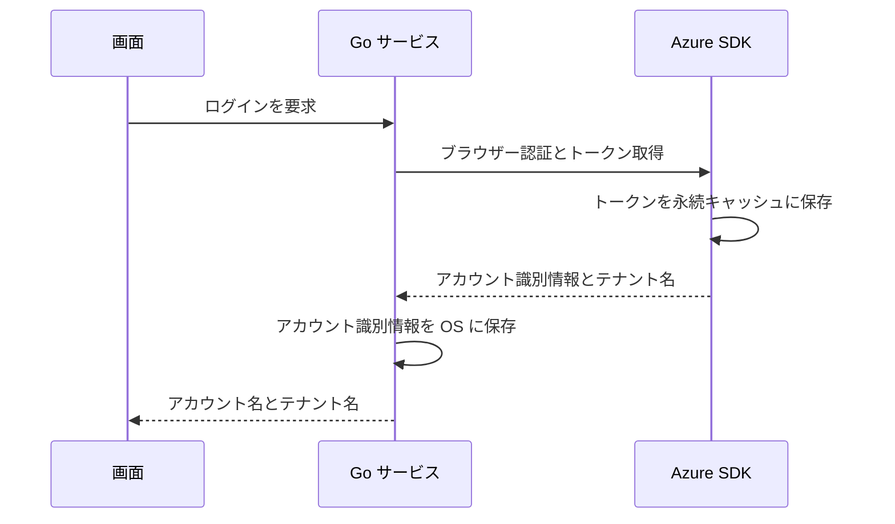
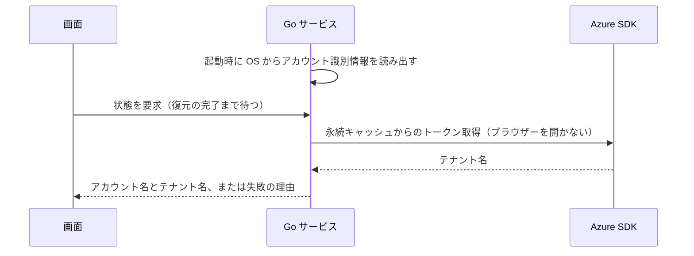
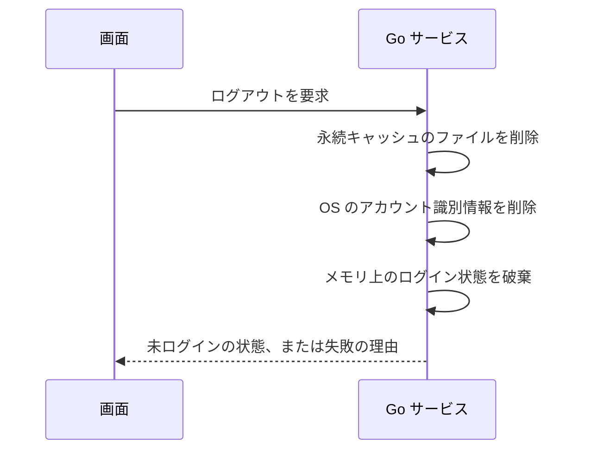
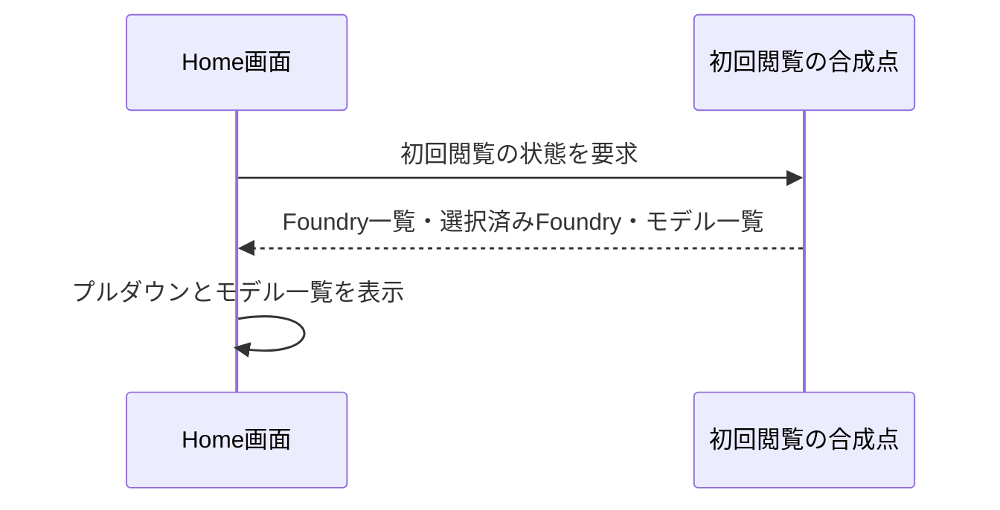

# UCP-1. 画面操作から Go サービス経由で Azure SDK を呼ぶ

適用条件と関与コンテナは [アーキテクチャの一覧](../architecture.md#patterns) を参照します。パターンからの逸脱は対象 UC ごとに本書へ記録します。図は主成功系列を役割名で示します。

| 役割 | 責務 | 実装パス（段階4完了時に記入） |
| --- | --- | --- |
| 画面 | ボタンと状態（未ログイン・サインイン待ち・ログイン済み・失敗）の表示、ユーザーアイコンのメニューからのログアウト | `frontend/src/usecases/azure-login/AzureLogin.tsx`、`frontend/src/usecases/azure-logout/AccountMenu.tsx`、`frontend/src/features/auth/queries.ts` |
| Go サービス | ログインの実行、起動時の保存済みアカウント識別情報によるログインの復元、ログアウト、ログイン状態の保持、アカウント識別情報の資格情報マネージャーへの保存・読み出し・削除、永続キャッシュのファイル削除 | `internal/azauth/service.go`、`internal/azauth/credential_manager.go`、`internal/azauth/token_cache_windows.go`、`record_store.go` |
| Azure SDK | `azidentity` によるブラウザー認証、トークン取得と永続キャッシュへの保存、永続キャッシュからのブラウザーを開かないトークン取得、ARM からのテナント名取得 | `internal/azauth/browser.go` |

起動時の復元（拡張「保存済みのログイン情報で自動的にログイン済みになる」）は次のとおりです。画面の状態取得は復元の完了まで応答を待ち、その間はモーダルを表示しません。

ログアウト（ユースケース「Azureからログアウトする」）は次のとおりです。永続キャッシュは SDK に削除 API がないため、Go サービスが SDK の定めるファイルを削除します。

- 整合性: 状態更新の主体 Go サービス / 結果確定点 手動ログインはトークン取得（永続キャッシュへの保存を含む）、テナント名取得、アカウント識別情報の保存のすべての成功時。起動時の復元はアカウント識別情報の読み出し、トークン取得、テナント名取得のすべての成功時 / 障害時の停止・継続 いずれかが失敗すれば未ログインのままにし、理由を画面へ返す。復元の失敗では保存済みのアカウント識別情報を削除しない。ログアウトは永続キャッシュとアカウント識別情報の両方の削除の成功時に未ログインを確定し、いずれかが失敗すればログイン済みのまま理由を返す
- モックに置き換える境界と合成点: デプロイモデルの初回閲覧は Home画面が受け取る `InitialFoundryView` を合成点とし、画面確認用ビルドで固定データを渡す。認証は E2E 用ビルド（`e2e` タグ）に限り、`internal/azauth/e2e.go` と `record_store_e2e.go` で Azure SDK 側のサインイン・復元・キャッシュ削除と保存先を差し替える

## デプロイモデルの初回閲覧

Home画面は `frontend/src/usecases/initial-deployments/InitialDeployments.tsx` で Foundry とデプロイ済みモデルを表示する。入出力の型は `frontend/src/features/foundry/models.ts` の `Foundry`、`Deployment`、`InitialFoundryView` を共有する。Foundry はリソース ID で識別し、選択済み Foundry を `selectedFoundryId` で参照する。

画面確認用ビルドは `frontend/src/routes/index.tsx` の `VITE_FOUNDRY_REVIEW=1` を唯一の切り替え箇所とし、`frontend/src/features/foundry/initial-view.ts` の固定表を画面に渡す。通常ビルドではこの画面モックを有効にしない。固定表は Foundry 3件、最初に発見した Foundry の選択、その Foundry のデプロイ済みモデル3件を表す。Azure の並列取得とファイル保存はモックで再実装しない。

モックの表示状態は React Query で保持する。プルダウンを開閉しても初期選択を変更しない。別の Foundry への切り替えはこの系列に含まない。実処理の並列取得・永続化・障害時動作はこのモックによる検証対象外とする。
