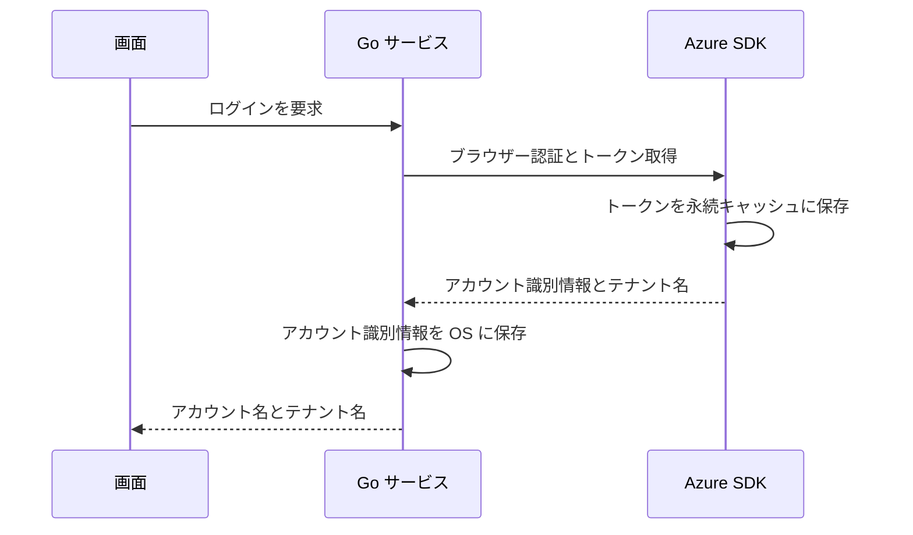
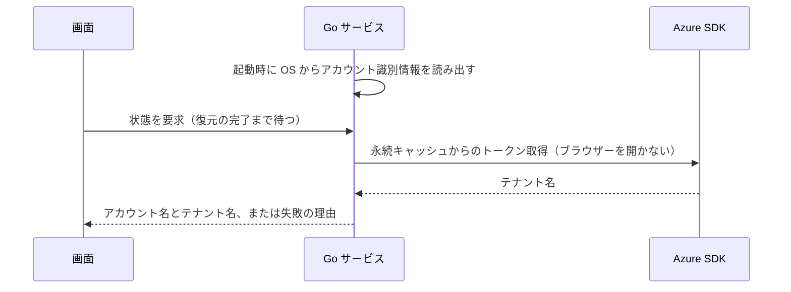

# UCP-1. 画面操作から Go サービス経由で Azure SDK を呼ぶ

適用条件と関与コンテナは [アーキテクチャの一覧](../architecture.md#patterns) を参照します。パターンからの逸脱は対象 UC ごとに本書へ記録します。図は主成功系列を役割名で示します。

| 役割 | 責務 | 実装パス（段階4完了時に記入） |
| --- | --- | --- |
| 画面 | ボタンと状態（未ログイン・サインイン待ち・ログイン済み・失敗）の表示 | `frontend/src/usecases/azure-login/AzureLogin.tsx`、`frontend/src/features/auth/queries.ts` |
| Go サービス | ログインの実行、起動時の保存済みアカウント識別情報によるログインの復元、ログイン状態の保持、アカウント識別情報の資格情報マネージャーへの保存と読み出し | `internal/azauth/service.go`、`internal/azauth/credential_manager.go`、`record_store.go` |
| Azure SDK | `azidentity` によるブラウザー認証、トークン取得と永続キャッシュへの保存、永続キャッシュからのブラウザーを開かないトークン取得、ARM からのテナント名取得 | `internal/azauth/browser.go` |

起動時の復元（拡張「保存済みのログイン情報で自動的にログイン済みになる」）は次のとおりです。画面の状態取得は復元の完了まで応答を待ち、その間はモーダルを表示しません。

- 整合性: 状態更新の主体 Go サービス / 結果確定点 手動ログインはトークン取得（永続キャッシュへの保存を含む）、テナント名取得、アカウント識別情報の保存のすべての成功時。起動時の復元はアカウント識別情報の読み出し、トークン取得、テナント名取得のすべての成功時 / 障害時の停止・継続 いずれかが失敗すれば未ログインのままにし、理由を画面へ返す。復元の失敗では保存済みのアカウント識別情報を削除しない
- モックに置き換える境界と合成点: なし。E2E 用ビルド（`e2e` タグ）に限り、`internal/azauth/e2e.go` と `record_store_e2e.go` で Azure SDK 側のサインイン・復元と保存先を差し替える
