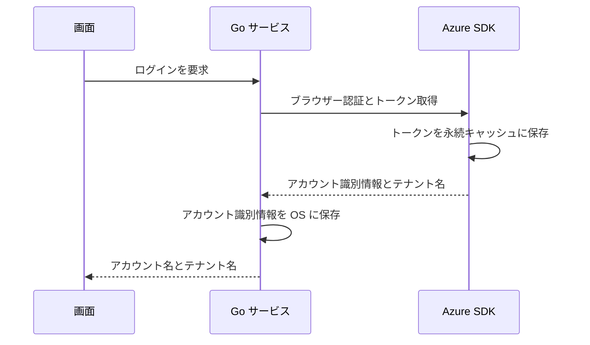
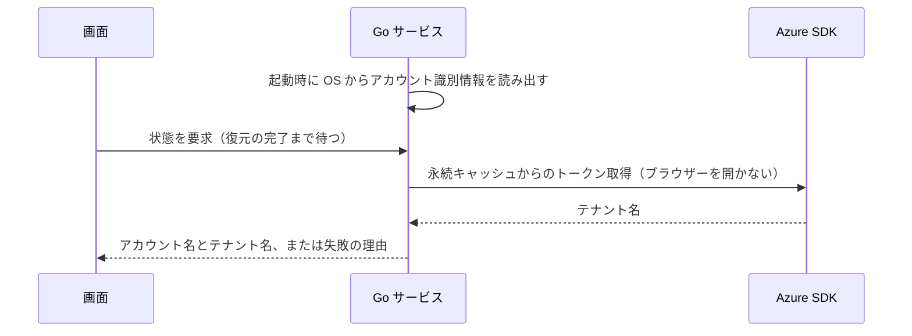
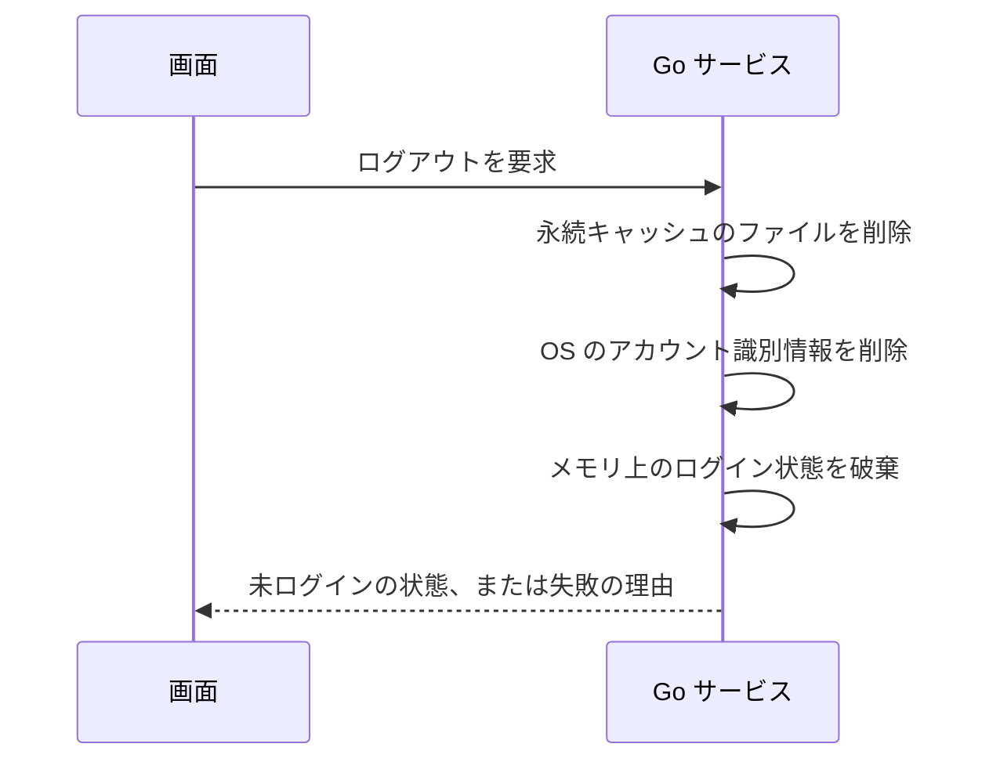
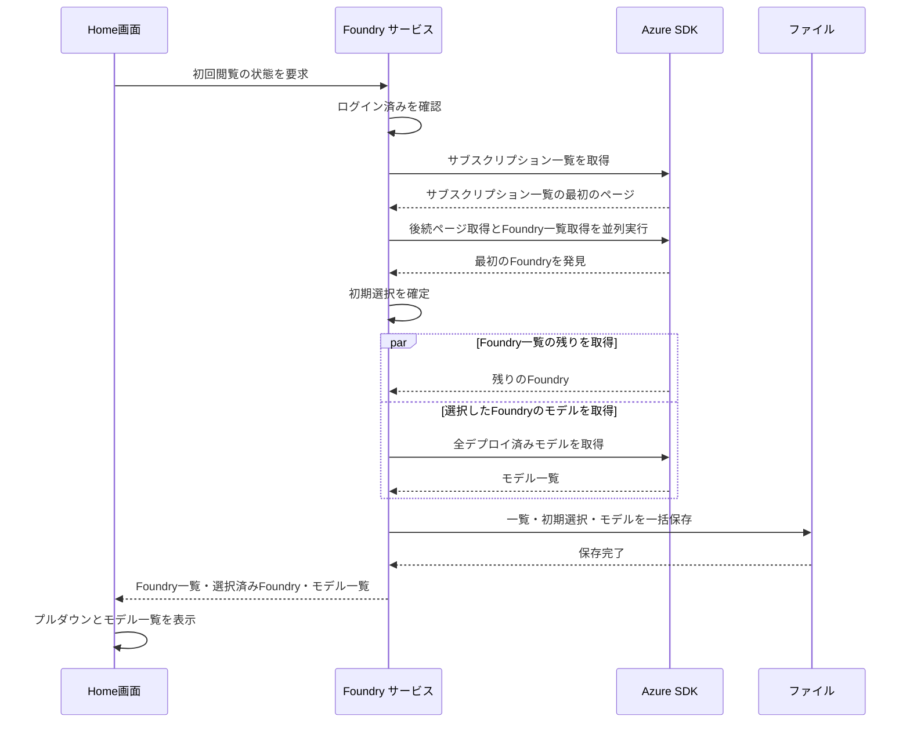

# UCP-1. 画面操作から Go サービス経由で Azure SDK を呼ぶ

適用条件と関与コンテナは [アーキテクチャの一覧](../architecture.md#patterns) を参照します。パターンからの逸脱は対象 UC ごとに本書へ記録します。図は主成功系列を役割名で示します。

| 役割 | 責務 | 実装パス |
| --- | --- | --- |
| 画面 | ボタンと状態（未ログイン・サインイン待ち・ログイン済み・失敗）の表示、ユーザーアイコンのメニューからのログアウト | `frontend/src/usecases/azure-login/AzureLogin.tsx`、`frontend/src/usecases/azure-logout/AccountMenu.tsx`、`frontend/src/features/auth/queries.ts` |
| Go サービス | ログインの実行、起動時の保存済みアカウント識別情報によるログインの復元、ログアウト、ログイン状態の保持、アカウント識別情報の資格情報マネージャーへの保存・読み出し・削除、永続キャッシュのファイル削除 | `internal/azauth/service.go`、`internal/azauth/credential_manager.go`、`internal/azauth/token_cache_windows.go`、`record_store.go` |
| Azure SDK | `azidentity` によるブラウザー認証、トークン取得と永続キャッシュへの保存、永続キャッシュからのブラウザーを開かないトークン取得、ARM からのテナント名取得 | `internal/azauth/browser.go` |
| Home画面 | ログイン済みでの初回閲覧要求、検索・Foundry取得・モデル取得・保存の進捗モーダル、Foundry のプルダウンとデプロイ済みモデルの表示、取得結果のメモリ保持 | `frontend/src/routes/index.tsx`、`frontend/src/usecases/initial-deployments/InitialDeployments.tsx`、`frontend/src/usecases/initial-deployments/AcquisitionProgressModal.tsx`、`frontend/src/features/foundry/initial-view.ts`、`frontend/src/features/foundry/progress.ts` |
| Foundry サービス | ログイン済みの確認、最初に発見した Foundry の選択、一覧取得とモデル取得の並行実行、全取得後のファイル保存、結果確定 | `main.go`、`foundry_source.go`、`internal/foundry/service.go`、`internal/foundry/models.go`、`internal/foundry/storage.go` |
| Foundry の Azure SDK 境界 | サブスクリプション一覧と Foundry 一覧の取得、選択した Foundry の全デプロイ済みモデル取得 | `internal/foundry/azure.go` |

起動時の復元（拡張「保存済みのログイン情報で自動的にログイン済みになる」）は次のとおりです。画面の状態取得は復元の完了まで応答を待ち、その間はモーダルを表示しません。

ログアウト（ユースケース「Azureからログアウトする」）は次のとおりです。永続キャッシュは SDK に削除 API がないため、Go サービスが SDK の定めるファイルを削除します。

- 整合性: 状態更新の主体 Go サービス / 結果確定点 手動ログインはトークン取得（永続キャッシュへの保存を含む）、テナント名取得、アカウント識別情報の保存のすべての成功時。起動時の復元はアカウント識別情報の読み出し、トークン取得、テナント名取得のすべての成功時 / 障害時の停止・継続 いずれかが失敗すれば未ログインのままにし、理由を画面へ返す。復元の失敗では保存済みのアカウント識別情報を削除しない。ログアウトは永続キャッシュとアカウント識別情報の両方の削除の成功時に未ログインを確定し、いずれかが失敗すればログイン済みのまま理由を返す
- モックに置き換える境界と合成点: 進捗表示は `frontend/src/features/foundry/initial-view.ts` の初回閲覧ローダーを唯一の合成点とし、`VITE_FOUNDRY_PROGRESS_REVIEW=1` の画面確認用ビルドで `progress-review.ts` の固定タイムラインを、本番にも使う `progress.ts` の `FoundryProgress` 型で渡す。結果の取得は既存の `Service.GetInitialView` を利用する。E2E 用ビルド（`e2e` タグ）では Go の外部境界 `foundry.Source` を `internal/foundry/e2e.go` と `foundry_source_e2e.go` の固定応答に差し替え、本番と同じ `InitialFoundryView` を返す。初期選択・ファイル保存・結果表示は実処理を通し、結果の固定表を画面側に重複させない。認証も同じビルドに限り、`internal/azauth/e2e.go` と `record_store_e2e.go` で Azure SDK 側のサインイン・復元・キャッシュ削除と保存先を差し替える

## デプロイモデルの初回閲覧

Home画面はログイン済みになったときに `Service.GetInitialView` を呼び、`frontend/src/usecases/initial-deployments/InitialDeployments.tsx` で Foundry とデプロイ済みモデルを表示する。入出力の型は `internal/foundry/models.go` の `Foundry`、`Deployment`、`InitialFoundryView` を Wails のバインディングで生成し、`frontend/src/features/foundry/models.ts` から再公開する。Foundry はリソース ID で識別し、選択済み Foundry を `selectedFoundryId` で参照する。

進捗モーダルは `FoundryProgress` を受け取り、検索状態と発見件数、サブスクリプションごとの待機・取得中と Foundry 件数、完了数、選択した Foundry とモデル取得状態・件数、ファイル保存状態を表示する。完了した行は一覧から削除し、残った行の発見順を維持する。完了数と発見件数は一覧から削除した行も含めて集計する。処理中は Escape と外側クリックでも閉じない。結果取得と保存の成功後に自動で閉じる。取得失敗は既存の Home画面のエラー表示に従う。

段階2の画面確認用タイムラインは約12秒で、サブスクリプション12件の発見、8件取得中・4件待機、開始順とは異なる完了と行の削除、モデル3件の取得完了、保存中から結果表示への遷移を再現する。通常ビルドでは固定タイムラインを無効にする。実 Azure の詳細進捗イベントと `FoundryProgress` の接続は段階4で行うため、現在は未接続であり、以下の既存の Azure 取得・保存処理は維持する。

Go サービスはログイン済みを確認し、保存済みアカウント識別情報と永続トークンキャッシュを使う `azauth.NewSilentCredential` で Azure SDK を呼ぶ。追加のブラウザー認証は行わない。サブスクリプション一覧の各ページで見つかったサブスクリプションの Foundry 一覧取得を開始し、サブスクリプションの後続ページ取得と並行して最大8並列で実行する。どの一覧も全ページを取得する。最初に発見した Foundry を一度だけ選択し、残りの Foundry の取得完了を待たずにその Foundry のデプロイ済みモデルの全ページ取得を開始する。後から見つかった Foundry によって選択を変更しない。

状態更新の主体は Go サービスで、Foundry 一覧と選択した Foundry の全モデルの取得、およびファイル保存のすべてが成功した時点で結果を確定する。取得または保存に失敗した場合は部分的な結果を返さず、Home画面に `FOUNDRY_LOAD_FAILED` を表示する。保存形式と置き換え方法は [データ設計](data.md#foundry-とデプロイモデル) を参照する。保存済みファイルや固定データへのフォールバックは行わない。

画面の取得結果は React Query で保持し、鮮度期限と破棄期限を無期限にする。自動再試行は行わず、ログアウト時にキャッシュを破棄する。プルダウンを開閉しても初期選択を変更しない。別の Foundry への切り替えと保存済みファイルからの復元はこの系列に含まない。画面確認用の固定データは Foundry 3件と選択した Foundry のデプロイ済みモデル3件で、実 Azure の一覧取得と並列通信の検証には使わない。
