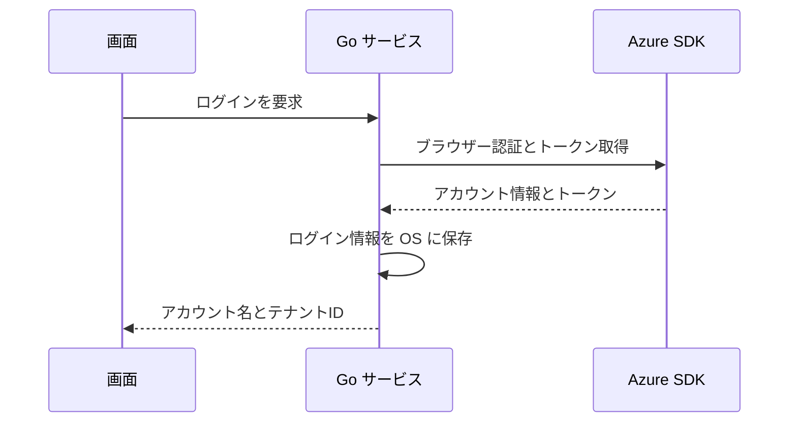

# UCP-1. 画面操作から Go サービス経由で Azure SDK を呼ぶ

適用条件と関与コンテナは [アーキテクチャの一覧](../architecture.md#patterns) を参照します。パターンからの逸脱は対象 UC ごとに本書へ記録します。図は主成功系列を役割名で示します。

| 役割 | 責務 | 実装パス（段階4完了時に記入） |
| --- | --- | --- |
| 画面 | ボタンと状態（未ログイン・サインイン待ち・ログイン済み・失敗）の表示 | |
| Go サービス | ログインの実行、ログイン状態の保持、ログイン情報の保存 | |
| Azure SDK | `azidentity` によるブラウザー認証とトークン取得 | |

- 整合性: 状態更新の主体 Go サービス / 結果確定点 トークン取得と保存の両方の成功時 / 障害時の停止・継続 どちらかが失敗すれば未ログインのままにし、理由を画面へ返す
- モックに置き換える境界と合成点: Go サービスと Azure SDK の境界の1箇所で固定のアカウント情報を返す。既定は実処理
