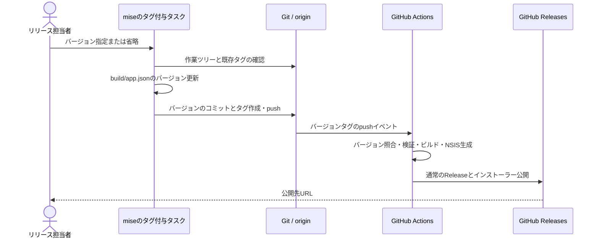
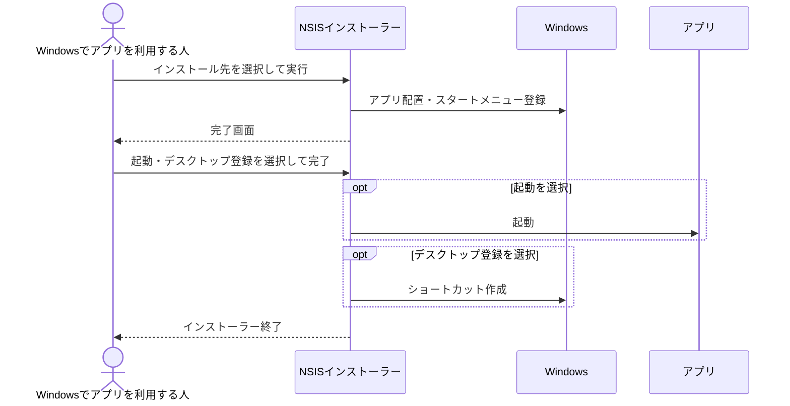

# UCP-2. ビルド処理とGitHub Actionsによるリリース

適用対象は [インストーラーをReleasesへ発行する](../usecases/インストーラーをReleasesへ発行する/README.md) と [アプリをインストールする](../usecases/アプリをインストールする/README.md)。デスクトップアプリの実行時処理とは分離したビルド・配布・インストール処理で、DBとアプリの保存データは変更しません。

## 責務と境界

| 処理 | 責務 | 実装パス |
| --- | --- | --- |
| タグ付与タスク | 入力・Gitの状態の検証、バージョン更新とコミット、タグ作成とpush | `mise.toml`、`scripts/release-tag.mjs` |
| Windows CI | タグとバージョンの一致確認、既存の検証・ビルド・NSIS生成 | `.github/workflows/windows.yml`、`scripts/run.mjs`、`scripts/build.mjs` |
| Release公開 | 成功したビルドのインストーラーを取得し、署名した `update.json`（[UCP-3](UCP-3.md)）と一緒にGitHub Releasesへ公開 | `.github/workflows/windows.yml`、`cmd/release/main.go` |
| インストーラー | アプリの配置、ショートカットの作成と削除、完了画面で選択されたアプリ起動 | `build/windows/nsis/project.nsi` |
| 画面確認用の生成 | 一時フォルダーで製品定義と配置する実行ファイルを確認用に差し替えてインストーラーを生成・起動 | `scripts/preview-installer.ps1` |

## 状態の確定と失敗時の扱い

入力と作業ツリー、ローカル・originのタグを確認してからファイルを更新します。バージョンを変えるコミットには `build/app.json` だけを含めます。対象ブランチのコミットとタグを同じpushで送信します。

Git操作の失敗はその時点で停止し、ファイル・コミット・タグの自動巻き戻しや自動再試行は行いません。担当者は出力とGitの状態を確認します。

タグのpushでは製品側だけを検証し、差分による実行省略は行いません。タグとアプリのバージョン不一致はビルド前に停止します。Release公開はビルドジョブがすべて成功してから行い、既存Releaseは変更しません。外部API呼び出しの失敗はCIの失敗として報告します。

Releasesへ発行する系列にはUIとモックの合成点はありません。一時Gitリポジトリとローカルのbareリポジトリを使用し、タグ付与タスクを実行してバージョン・コミット・タグ・pushを手動検証します。運用と検証のコマンドは [プロジェクト定義](../project.md#commands) を参照します。

## インストールの完了画面

NSISがインストール先への配置とスタートメニューへの登録を行い、完了画面の選択を受け取ります。完了操作時のショートカット作成とアプリ起動には、本番と画面確認で同じNSISの処理を使用します。表示項目・初期状態・選択後の動作は [対象シナリオ](../usecases/アプリをインストールする/scenarios/インストールを完了して起動方法を選ぶ.md) を参照します。

選択状態はインストーラーが保持し、「完了」を押した時点で処理対象が確定します。アンインストール処理が作成したショートカットを削除します。

画面確認の合成点はインストーラー生成時の製品定義と配置対象の実行ファイルです。一時フォルダーで本番と同じ `project.nsi` に確認用の製品IDと固定の実行ファイルを渡し、本番アプリや利用者のインストール先を変更せずに、完了画面の選択と結果を確認します。本番のインストーラー生成では製品定義とアプリの実行ファイルを使用します。

E2Eは `tests/e2e/usecases/アプリをインストールする/インストールを完了して起動方法を選ぶ.ps1` に配置します。`scripts/preview-installer.ps1 -BuildOnly` が同じ合成点でインストーラーを生成し、起動先は記録を書いて終了する実行ファイルとします。Win32で非表示のウィンドウとチェック状態を取得し、完了操作に対応する通知を送ります。アプリの起動記録、両ショートカットの対象、アンインストール時の登録・ショートカット削除まで検証し、失敗時も確認用インストールを片付けます。確認用の製品IDとショートカット名は実行ごとに分離します。
