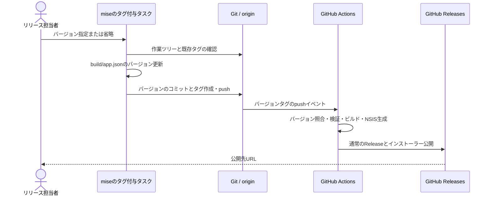

# UCP-2. ビルド処理とGitHub Actionsによるリリース

適用対象は [インストーラーをReleasesへ発行する](../usecases/インストーラーをReleasesへ発行する/README.md)。デスクトップアプリの実行時処理とは分離したビルド・配布処理で、DBとアプリの保存データは変更しません。

## 責務と境界

| 処理 | 責務 | 実装パス |
| --- | --- | --- |
| タグ付与タスク | 入力・Gitの状態の検証、バージョン更新とコミット、タグ作成とpush | `mise.toml`、`scripts/release-tag.mjs` |
| Windows CI | タグとバージョンの一致確認、既存の検証・ビルド・NSIS生成 | `.github/workflows/windows.yml`、`scripts/run.mjs`、`scripts/build.mjs` |
| Release公開 | 成功したビルドのインストーラーを取得し、GitHub Releasesへ公開 | `.github/workflows/windows.yml` |

## 状態の確定と失敗時の扱い

入力と作業ツリー、ローカル・originのタグを確認してからファイルを更新します。バージョンを変えるコミットには `build/app.json` だけを含めます。対象ブランチのコミットとタグを同じpushで送信します。

Git操作の失敗はその時点で停止し、ファイル・コミット・タグの自動巻き戻しや自動再試行は行いません。担当者は出力とGitの状態を確認します。

タグのpushでは製品側だけを検証し、差分による実行省略は行いません。タグとアプリのバージョン不一致はビルド前に停止します。Release公開はビルドジョブがすべて成功してから行い、既存Releaseは変更しません。外部API呼び出しの失敗はCIの失敗として報告します。

UIとモックの合成点はありません。段階4では一時Gitリポジトリとローカルのbareリポジトリを使用し、タグ付与タスクを実行してバージョン・コミット・タグ・pushを手動検証します。運用と検証のコマンドは [プロジェクト定義](../project.md#commands) を参照します。
