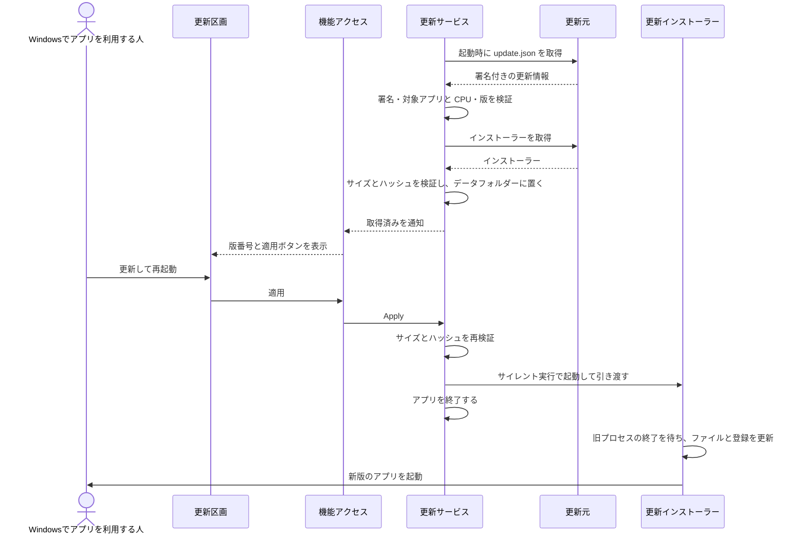

# UCP-3. 検証・引き渡し・外部プロセスによる確定

適用対象は [新版を確認してアプリを更新する](../usecases/新版を確認してアプリを更新する/README.md)。本体が検証済みの新版を外部プロセス（インストーラー）へ引き渡し、本体の終了後にインストーラーが確定します。

## 責務と境界

| 役割 | 責務 | 実装パス（実装フェーズ完了時に記入） |
| --- | --- | --- |
| 更新区画 | 取得・検証済みの新版があるときだけ、版番号と適用ボタンを Home画面の先頭に表示する。再検証の失敗を表示する | |
| 機能アクセス | 更新サービスから状態を取得し、状態変化の通知を画面の状態へ反映する。適用を呼び出す | |
| 更新サービス | 起動時に1回、更新情報を取得して署名・対象・版を検証し、新版ならインストーラーを取得してサイズとハッシュを検証して置く。取得済みになったら画面へ通知する。適用時に再検証し、インストーラーを起動してアプリを終了する | |
| 更新元 | GitHub Releases の最新リリースから、`update.json` と同じリリースのインストーラーを HTTPS で読み出す。URL と公開鍵は `build/app.json` の `updateSource`・`updatePublicKey` に置く | |
| 更新インストーラー | 旧プロセスの終了を待ってから、ファイルとアンインストール情報を更新し、サイレント実行時も新版を起動する | `build/windows/nsis/project.nsi` |
| リリース準備 | インストーラーの版・サイズ・ハッシュを入れた更新情報を、リポジトリ外の Ed25519 秘密鍵（CI では Secrets の `UPDATE_SIGNING_KEY`）で署名して `update.json` を作り、インストーラーと同じ Release に添付する | |

## 状態の確定と失敗時の扱い

配置までの状態は更新サービス、確定はインストーラーが担当し、結果確定点はインストーラーによるファイルと登録の更新の完了です。確認・取得・再検証が失敗した場合は現行版のまま動き続け、配置途中のファイルを削除します。インストーラーは旧プロセスの終了を確認できなければ何も変更せずに中止します。更新サービスの操作は1件ずつ処理し、適用後はアプリを終了します。

取得したインストーラーはアプリのデータフォルダーの `updates/` に置き、起動後に新版の確認を始める前に中身ごと削除します。ログイン情報・トークンキャッシュ・閲覧保存データには触れません。

モック確認では、モック有効の起動のときだけ、更新元を署名付きの v0.2.0 を置いたローカルのフォルダーへ向け、インストーラーの起動を何もしない処理に置き換えます。確認・取得・検証・適用前の再検証は本番の処理を使います。合成点は更新サービスに渡す更新元とインストーラー起動の2つの依存で、`main.go` の組み立て1箇所で切り替えます。実装フェーズで削除します。

UC 固有の逸脱: なし
